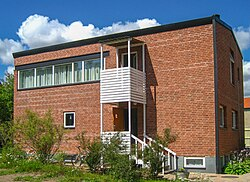
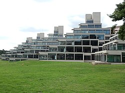
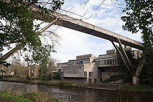
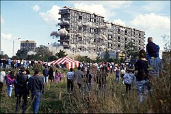
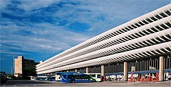
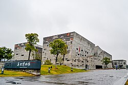

<!--
  Source: https://en.wikipedia.org/wiki/Brutalist_architecture
  Crawled: 2026-09-04T08:17:25.152990
-->

# Brutalist architecture - Wikipedia

From Wikipedia, the free encyclopediaArchitectural style"Brutalist" and "Brutalism" redirect here. For the 2024 film, see [The Brutalist](https://en.wikipedia.org/wiki/The_Brutalist). For other uses, see [Brutalism (disambiguation)](https://en.wikipedia.org/wiki/Brutalism_(disambiguation)).

| Brutalist architecture |
| Top row:Park Hillflats inSheffield, England;Soviet-era housing inTalnakh, Russia;Teresa Carreño Cultural ComplexinCaracas, Venezuela.Middle row:Royal National Theatrein London;Boston City Hall; Soviet-era housing inSaint Petersburg.Bottom row:Robarts LibraryinToronto, Canada;Barbican Centrein theCity of London;Alexandra Road Estatein London. |
| Additional media |
| Years active | 1950s – early 1980s |
| Location | International |

**Brutalist architecture** is an [architectural style](https://en.wikipedia.org/wiki/Architectural_style) that emerged during the 1950s in the [United Kingdom](https://en.wikipedia.org/wiki/United_Kingdom), among the reconstruction projects of the [post-war](https://en.wikipedia.org/wiki/Post-war) era.[[1]](#cite_note-1)[[2]](#cite_note-2)[[3]](#cite_note-3)[[4]](#cite_note-:12-4)[[5]](#cite_note-5) Brutalist buildings are known for [minimalist](https://en.wikipedia.org/wiki/Minimalism_(art)) construction showcasing the bare [building materials](https://en.wikipedia.org/wiki/Building_materials) and [structural elements](https://en.wikipedia.org/wiki/Structural_engineering) over decorative design.[[6]](#cite_note-Dezeen2-6)[[7]](#cite_note-AD2-7) The style commonly makes use of exposed, unpainted [concrete](https://en.wikipedia.org/wiki/Concrete) or [brick](https://en.wikipedia.org/wiki/Brick), angular [geometric](https://en.wikipedia.org/wiki/Geometric) shapes and a predominantly [monochrome](https://en.wikipedia.org/wiki/Monochrome) colour palette;[[7]](#cite_note-AD2-7)[[8]](#cite_note-:4-8) other materials, such as [steel](https://en.wikipedia.org/wiki/Steel), [timber](https://en.wikipedia.org/wiki/Timber), and [glass](https://en.wikipedia.org/wiki/Glass), are also featured.[[9]](#cite_note-bbcarts-9)

Descended from [modernism](https://en.wikipedia.org/wiki/Modernism), brutalism is said to be a reaction against the [nostalgia](https://en.wikipedia.org/wiki/Nostalgia) of architecture in the 1940s.[[10]](#cite_note-:32-10) Derived from the Swedish word *nybrutalism*, the term "new brutalism" was first used by British architects [Alison and Peter Smithson](https://en.wikipedia.org/wiki/Alison_and_Peter_Smithson) for their pioneering approach to design.[[8]](#cite_note-:4-8)[[11]](#cite_note-:5-11)[[12]](#cite_note-The_NB-12):10 The style was further popularised in a 1955 essay by architectural critic [Reyner Banham](https://en.wikipedia.org/wiki/Reyner_Banham), who also associated the movement with the French phrases *[béton brut](https://en.wikipedia.org/wiki/Béton_brut)* ("raw concrete") and *[art brut](https://en.wikipedia.org/wiki/Art_brut)* ("raw art").[[13]](#cite_note-:0-13)[[14]](#cite_note-14) The style, as developed by architects such as the Smithsons, Hungarian-born [Ernő Goldfinger](https://en.wikipedia.org/wiki/Ernő_Goldfinger), and the British firm [Chamberlin, Powell & Bon](https://en.wikipedia.org/wiki/Chamberlin,_Powell_and_Bon), was partly foreshadowed by the modernist work of other architects such as French-Swiss [Le Corbusier](https://en.wikipedia.org/wiki/Le_Corbusier), Estonian-American [Louis Kahn](https://en.wikipedia.org/wiki/Louis_Kahn), German-American [Ludwig Mies van der Rohe](https://en.wikipedia.org/wiki/Ludwig_Mies_van_der_Rohe), and Finnish [Alvar Aalto](https://en.wikipedia.org/wiki/Alvar_Aalto).[[7]](#cite_note-AD2-7)[[15]](#cite_note-15)

In the United Kingdom, brutalism was featured in the design of utilitarian, low-cost [social housing](https://en.wikipedia.org/wiki/Social_housing) influenced by [socialist](https://en.wikipedia.org/wiki/Socialist) principles and soon spread to other regions around the world, while being echoed by similar styles like in [Eastern Europe](https://en.wikipedia.org/wiki/Eastern_Europe).[[16]](#cite_note-16)[[6]](#cite_note-Dezeen2-6)[[7]](#cite_note-AD2-7)[[17]](#cite_note-17) Brutalist designs became most commonly used in the design of institutional buildings, such as provincial legislatures, public works projects, [universities](https://en.wikipedia.org/wiki/University), [libraries](https://en.wikipedia.org/wiki/Library), [courts](https://en.wikipedia.org/wiki/Court), and [city halls](https://en.wikipedia.org/wiki/City_hall). The popularity of the movement began to decline in the late 1970s, with some associating the style with [urban decay](https://en.wikipedia.org/wiki/Urban_decay) and [totalitarianism](https://en.wikipedia.org/wiki/Totalitarianism).[[7]](#cite_note-AD2-7) Brutalism's popularity in socialist and communist nations owed to traditional styles being associated with the [bourgeoisie](https://en.wikipedia.org/wiki/Bourgeoisie), whereas concrete emphasized equality.[[18]](#cite_note-18)

Brutalism has been polarising historically; specific buildings, as well as the movement as a whole, have drawn a range of criticism (often being described as "cold"). There are often public-led campaigns to demolish brutalist buildings. Some people are favourable to the style, and in the United Kingdom some buildings have been preserved.

## History

[[edit](/w/index.php?title=Brutalist_architecture&action=edit&section=1)][Villa Göth](https://en.wikipedia.org/wiki/Villa_Göth) (1950) in Kåbo, [Uppsala](https://en.wikipedia.org/wiki/Uppsala), Sweden. "New Brutalism" was used for the first time to describe this house.

The term *nybrutalism* (new brutalism)[[19]](#cite_note-A-Z-19) was coined by the Swedish architect [Hans Asplund](https://en.wikipedia.org/wiki/Hans_Asplund) to describe [Villa Göth](https://en.wikipedia.org/wiki/Villa_Göth), a modern brick home in [Uppsala](https://en.wikipedia.org/wiki/Uppsala), designed in January 1950[[11]](#cite_note-:5-11) by his contemporaries Bengt Edman and Lennart Holm.[[12]](#cite_note-The_NB-12):10 Showcasing the "as found" design approach that would later be at the core of brutalism, the house displays visible [I-beams](https://en.wikipedia.org/wiki/I-beam) over windows, exposed brick inside and out, and poured concrete in several rooms where the [tongue-and-groove](https://en.wikipedia.org/wiki/Tongue-and-groove) pattern of the boards used to build the forms can be seen.[[20]](#cite_note-20)[[13]](#cite_note-:0-13) The term was picked up in the summer of 1950 by a group of visiting English architects, including [Michael Ventris](https://en.wikipedia.org/wiki/Michael_Ventris), Oliver Cox, and Graeme Shankland, where it apparently "spread like wildfire, and [was] subsequently adopted by a certain faction of young British architects".[[19]](#cite_note-A-Z-19)[[21]](#cite_note-21)[[12]](#cite_note-The_NB-12):10

The first published usage of the phrase "new brutalism" occurred in 1953, when Alison Smithson used it to describe a plan for their unbuilt [Soho](https://en.wikipedia.org/wiki/Soho) house which appeared in the November issue of *[Architectural Design](https://en.wikipedia.org/wiki/Architectural_Design)*.[[13]](#cite_note-:0-13)[[9]](#cite_note-bbcarts-9) She further stated: "It is our intention in this building to have the structure exposed entirely, without interior finishes wherever practicable."[[12]](#cite_note-The_NB-12):10[[13]](#cite_note-:0-13) The Smithsons' [Hunstanton School](https://en.wikipedia.org/wiki/Hunstanton_School) completed in 1954 in [Norfolk](https://en.wikipedia.org/wiki/Norfolk), and the Sugden House completed in 1955 in [Watford](https://en.wikipedia.org/wiki/Watford), represent the earliest examples of new brutalism in the United Kingdom.[[4]](#cite_note-:12-4) Hunstanton school, likely inspired by [Mies van der Rohe](https://en.wikipedia.org/wiki/Mies_van_der_Rohe)'s 1946 Alumni Memorial Hall at the [Illinois Institute of Technology](https://en.wikipedia.org/wiki/Illinois_Institute_of_Technology) in [Chicago](https://en.wikipedia.org/wiki/Chicago), United States, is notable as the first completed building in the world to carry the title of "new brutalist" by its architects.[[12]](#cite_note-The_NB-12):19[[22]](#cite_note-22) At the time, it was described as "the most truly modern building in England".[[23]](#cite_note-23)

The term gained increasingly wider recognition when British architectural historian [Reyner Banham](https://en.wikipedia.org/wiki/Reyner_Banham) used it to identify both an ethic and aesthetic style, in his 1955 essay *The New Brutalism*. In the essay, Banham described Hunstanton and the Soho house as the "reference by which The New Brutalism in architecture may be defined".[[13]](#cite_note-:0-13) Reyner Banham also associated the term "new brutalism" with [art brut](https://en.wikipedia.org/wiki/Art_brut) and *[béton brut](https://en.wikipedia.org/wiki/Béton_brut)*

Banham further expanded his thoughts in the 1966 book *The New Brutalism: Ethic or Aesthetic?* to characterise a somewhat recently established cluster of architectural approaches, particularly in Europe.[[26]](#cite_note-26) In the book, Banham says that Le Corbusier's concrete work was a source of inspiration and helped popularise the movement, suggesting "if there is one single verbal formula that has made the concept of Brutalism admissible in most of the world's Western languages, it is that Le Corbusier himself described that concrete work as 'béton-brut'".[[12]](#cite_note-The_NB-12):16 He further states that "the words 'The New Brutalism' were already circulating, and had acquired some depth of meaning through things said and done, over and above the widely recognised connection with *béton brut*

## Motif

[[edit](/w/index.php?title=Brutalist_architecture&action=edit&section=2)]Student dormitory (1971) by [Georgi Konstantinovski](https://en.wikipedia.org/wiki/Georgi_Konstantinovski) in [Skopje](https://en.wikipedia.org/wiki/Skopje), North Macedonia"TV buildings" named for the con­crete window frames that resemble TV screens ([Belgrade](https://en.wikipedia.org/wiki/Belgrade), Serbia)

New brutalism is not only an architectural style; it is also a philosophical approach to architectural design, a striving to create simple, honest, and functional buildings that accommodate their purpose, inhabitants, and location.[[27]](#cite_note-:2-27)[[28]](#cite_note-28) Stylistically, brutalism is a strict, modernistic design language that has been said to be a reaction to the architecture of the 1940s, much of which was characterised by a retrospective nostalgia.[[29]](#cite_note-:3-29) Peter Smithson believed that the core of brutalism was a reverence for materials, expressed honestly, stating that "Brutalism is not concerned with the material as such but rather the quality of material",[[30]](#cite_note-30) and "the seeing of materials for what they were: the woodness of the wood; the sandiness of sand".[[31]](#cite_note-31) Architect John Voelcker said that the "new brutalism" in architecture "cannot be understood through stylistic analysis, although some day a comprehensible style might emerge",[[32]](#cite_note-32) supporting the Smithsons' description of the movement as "an ethic, not an aesthetic".[[33]](#cite_note-33)

Reyner Banham felt that the phrase "the new brutalism" existed as both an attitude toward design and a descriptive label for the architecture itself and that it "eludes precise description, while remaining a living force". He attempted to codify the movement in systematic language, insisting that a brutalist structure must satisfy the following terms: "1,Formal legibility of plan; 2,clear exhibition of structure, and 3,valuation of materials for their inherent qualities 'as found'."[[13]](#cite_note-:0-13) Also important was the aesthetic "image", or "coherence of the building as a visual entity".[[13]](#cite_note-:0-13)

Brutalist buildings are usually constructed with recurring modular elements representing specific functional zones, distinctly articulated and grouped together into a unified whole. There is often an emphasis on graphic expressions in the external elevations and in the whole-site [architectural plan](https://en.wikipedia.org/wiki/Architectural_plan) in regard to the main functions and people-flows of the buildings.[[34]](#cite_note-GRIDS-34) Buildings may use materials such as concrete, brick, glass, steel, timber, rough-hewn stone, and [gabions](https://en.wikipedia.org/wiki/Gabion) among others.[[8]](#cite_note-:4-8) However, due to its low cost, raw concrete is often used and left to reveal the basic nature of its construction with rough surfaces featuring wood "shuttering" produced when the forms were cast [in situ](https://en.wikipedia.org/wiki/In_situ#Civil_engineering).[[8]](#cite_note-:4-8) Examples are frequently massive in character (even when not large) and challenge traditional notions of what a building should look like with focus given to interior spaces as much as exterior.[[13]](#cite_note-:0-13)[[8]](#cite_note-:4-8)

A common theme in brutalist designs is the exposure of the building's inner-workings—ranging from their structure and services to their human use—in the exterior of the building. In the [Boston City Hall](https://en.wikipedia.org/wiki/Boston_City_Hall), designed in 1962, the strikingly different and projected portions of the building indicate the special nature of the rooms behind those walls, such as the mayor's office or the city council chambers. From another perspective, the design of the [Hunstanton School](https://en.wikipedia.org/wiki/Smithdon_High_School) included placing the facility's water tank, normally a hidden service feature, in a prominent, visible tower. Rather than being hidden in the walls, Hunstanton's water and electric utilities were delivered via readily visible pipes and conduits.[[13]](#cite_note-:0-13)

Brutalism as an architectural philosophy was often associated with a [socialist](https://en.wikipedia.org/wiki/Socialism)[utopian](https://en.wikipedia.org/wiki/Utopia) ideology, which tended to be supported by its designers, especially by [Alison and Peter Smithson](https://en.wikipedia.org/wiki/Alison_and_Peter_Smithson), near the height of the style. Indeed, their work sought to emphasize functionality and to connect architecture with what they viewed as the realities of modern life.[[27]](#cite_note-:2-27) Among their early contributions were "[streets in the sky](https://en.wikipedia.org/wiki/Streets_in_the_sky)" in which traffic and pedestrian circulation were rigorously separated, another theme popular in the 1960s.[[34]](#cite_note-GRIDS-34) This style had a strong position in the architecture of European [communist](https://en.wikipedia.org/wiki/Communist_state) countries from the mid-1960s to the late 1980s ([Bulgaria](https://en.wikipedia.org/wiki/People's_Republic_of_Bulgaria), [Czechoslovakia](https://en.wikipedia.org/wiki/Czechoslovak_Socialist_Republic), [East Germany](https://en.wikipedia.org/wiki/East_Germany), [USSR](https://en.wikipedia.org/wiki/Soviet_Union), [Yugoslavia](https://en.wikipedia.org/wiki/SFR_Yugoslavia)).[[35]](#cite_note-35) In Czechoslovakia, brutalism was presented as an attempt to create a "national" but also "modern socialist" architectural style. Such prefabricated socialist era buildings are called [panelaky](https://en.wikipedia.org/wiki/Panelák).

A sub-genre of brutalism is "brick brutalism" or "brickalism", where the dominant structural material is brick rather than concrete. Examples range from the Smithson's house in Soho (1952) to [Colin St John Wilson](https://en.wikipedia.org/wiki/Colin_St_John_Wilson)'s [British Library](https://en.wikipedia.org/wiki/British_Library) (1982–1998).[[36]](#cite_note-36)[[37]](#cite_note-37)[[38]](#cite_note-38)

## Designers

[[edit](/w/index.php?title=Brutalist_architecture&action=edit&section=3)]

### United Kingdom

[[edit](/w/index.php?title=Brutalist_architecture&action=edit&section=4)]

In the [United Kingdom](https://en.wikipedia.org/wiki/United_Kingdom), architects associated with the brutalist style include the wife-and-husband team of [Alison and Peter Smithson](https://en.wikipedia.org/wiki/Alison_and_Peter_Smithson), who pioneered the style, [Ernő Goldfinger](https://en.wikipedia.org/wiki/Ernő_Goldfinger), some of the work of Sir [Basil Spence](https://en.wikipedia.org/wiki/Basil_Spence), the [London County Council](https://en.wikipedia.org/wiki/London_County_Council)/[Greater London Council](https://en.wikipedia.org/wiki/Greater_London_Council) Architects Department, [Owen Luder](https://en.wikipedia.org/wiki/Owen_Luder), [John Bancroft](https://en.wikipedia.org/wiki/John_Bancroft_(architect)), [Norman Engleback](https://en.wikipedia.org/wiki/Norman_Engleback), who designed the [Hayward Gallery](https://en.wikipedia.org/wiki/Hayward_Gallery), and, arguably perhaps, Sir [Denys Lasdun](https://en.wikipedia.org/wiki/Denys_Lasdun), whose work included the brutalist [National Theatre](https://en.wikipedia.org/wiki/Royal_National_Theatre), Sir [Leslie Martin](https://en.wikipedia.org/wiki/Leslie_Martin), Sir [James Stirling](https://en.wikipedia.org/wiki/James_Stirling_(architect)) and [James Gowan](https://en.wikipedia.org/wiki/James_Gowan) with their early works. Partnerships included [Chamberlin, Powell and Bon](https://en.wikipedia.org/wiki/Chamberlin,_Powell_and_Bon), who designed the [Barbican Centre](https://en.wikipedia.org/wiki/Barbican_Centre).

### United States

[[edit](/w/index.php?title=Brutalist_architecture&action=edit&section=5)].jpg)The [Milwaukee County War Memorial](https://en.wikipedia.org/wiki/Milwaukee_County_War_Memorial) (1957) is an example of the brutalist architecture of [Eero Saarinen](https://en.wikipedia.org/wiki/Eero_Saarinen).

[Evans Woollen III](https://en.wikipedia.org/wiki/Evans_Woollen_III) is credited for introducing the Brutalist and Modernist architecture styles to [Indianapolis](https://en.wikipedia.org/wiki/Indianapolis), Indiana.[[39]](#cite_note-39)[Walter Netsch](https://en.wikipedia.org/wiki/Walter_Netsch) is known for his brutalist academic buildings. [Marcel Breuer](https://en.wikipedia.org/wiki/Marcel_Breuer) was known for his "soft" approach to the style, often using curves rather than corners. In [Atlanta](https://en.wikipedia.org/wiki/Atlanta), Georgia, the architectural style was introduced to Buckhead's affluent [Peachtree Road](https://en.wikipedia.org/wiki/Peachtree_Street) with the Ted Levy-designed Plaza Towers and [Park Place on Peachtree](https://en.wikipedia.org/wiki/Park_Place_(Atlanta)) condominiums. Architectural historian [William Jordy](https://en.wikipedia.org/wiki/William_Jordy) said that although [Louis Kahn](https://en.wikipedia.org/wiki/Louis_Kahn) was "[o]pposed to what he regarded as the muscular posturing of most Brutalism", some of his work "was surely informed by some of the same ideas that came to momentary focus in the brutalist position".[[40]](#cite_note-40)

### Australia

[[edit](/w/index.php?title=Brutalist_architecture&action=edit&section=6)]

In [Australia](https://en.wikipedia.org/wiki/Australia), architects working in the brutalist style included [Robin Gibson](https://en.wikipedia.org/wiki/Robin_Gibson_(architect)), designer of the [Queensland Art Gallery](https://en.wikipedia.org/wiki/Queensland_Art_Gallery), [Ken Woolley](https://en.wikipedia.org/wiki/Ken_Woolley), designer of the [Fisher Library](https://en.wikipedia.org/wiki/University_of_Sydney_Library) at the University of Sydney, [Christopher Kringas](https://en.wikipedia.org/wiki/Christopher_Kringas), who built the [High Court of Australia Building](https://en.wikipedia.org/wiki/High_Court_of_Australia_Building). [John Andrews](https://en.wikipedia.org/wiki/John_Andrews_(architect))'s government and institutional structures in Australia also exhibit the style. [Daryl Jackson](https://en.wikipedia.org/wiki/Daryl_Jackson) and [Kevin Borland](https://en.wikipedia.org/wiki/Kevin_Borland) designed one of the first brutalist buildings in Melbourne, the [Harold Holt Memorial Swimming Centre](https://en.wikipedia.org/wiki/Harold_Holt_Memorial_Swimming_Centre) in Malvern, in 1967.

### Canada

[[edit](/w/index.php?title=Brutalist_architecture&action=edit&section=7)]

Vancouver-based architect [Arthur Erickson](https://en.wikipedia.org/wiki/Arthur_Erickson) was responsible for several notable brutalist developments including [Simon Fraser University](https://en.wikipedia.org/wiki/Simon_Fraser_University)'s main campus building, the [MacMillan Bloedel Building](https://en.wikipedia.org/wiki/MacMillan_Bloedel_Building), the [Museum of Anthropology at the University of British Columbia](https://en.wikipedia.org/wiki/Museum_of_Anthropology_at_UBC) and the Vancouver [Law Courts](https://en.wikipedia.org/wiki/Law_Courts_(Vancouver)).[[41]](#cite_note-41)

The city of Winnipeg is noted for significant contributions to brutalist archiecture in Canada, including the Winnipeg Civic Centre (City Hall and Administrative Building) (1962–1963, Green Blankstein Russell)[[42]](#cite_note-42) as well as the [University of Manitoba Students' Union](https://en.wikipedia.org/wiki/University_of_Manitoba_Students'_Union) Building (1966–1969) and [Royal Manitoba Theatre Centre](https://en.wikipedia.org/wiki/Royal_Manitoba_Theatre_Centre) (1969–1970), both by Waisman Ross Blankstein Coop Gillmor Hanna (now Number Ten Architectural Group).[[43]](#cite_note-43)

### Argentina

[[edit](/w/index.php?title=Brutalist_architecture&action=edit&section=8)]The [Banco de Londres y América del Sur Headquarters](https://en.wikipedia.org/wiki/Banco_de_Londres_y_América_del_Sur_Headquarters) by [Clorindo Testa](https://en.wikipedia.org/wiki/Clorindo_Testa), in [Buenos Aires](https://en.wikipedia.org/wiki/Buenos_Aires), Argentina

In Argentina, the main representative of brutalism was [Clorindo Testa](https://en.wikipedia.org/wiki/Clorindo_Testa), who designed the [Banco de Londres y América del Sur Headquarters](https://en.wikipedia.org/wiki/Banco_de_Londres_y_América_del_Sur_Headquarters), and the [National Library of Argentina](https://en.wikipedia.org/wiki/National_Library_of_Argentina). [Federico Peralta Ramos](https://es.wikipedia.org/wiki/Federico_Peralta_Ramos) was responsible for the Entel (now Telefónica) building.[[44]](#cite_note-44)

### Serbia

[[edit](/w/index.php?title=Brutalist_architecture&action=edit&section=9)]

In [Serbia](https://en.wikipedia.org/wiki/Serbia), Božidar Janković was a representative of the so-called "Belgrade School of residence", identifiable by its functionalist relations on the basis of the flat[[45]](#cite_note-45) and elaborated in detail the architecture. [Mihajlo Mitrović](https://en.wikipedia.org/wiki/Mihajlo_Mitrović) designed the [Western City Gate](https://en.wikipedia.org/wiki/Western_City_Gate), also known as the Genex Tower, a 36-[storey](https://en.wikipedia.org/wiki/Storey)[skyscraper](https://en.wikipedia.org/wiki/Skyscraper) in [Belgrade](https://en.wikipedia.org/wiki/Belgrade), Serbia, in 1977.[[46]](#cite_note-46) It is formed by two towers connected with a two-storey bridge and [revolving restaurant](https://en.wikipedia.org/wiki/Revolving_restaurant) at the top. It is 117m (384ft) tall[[47]](#cite_note-arhi-47) (with restaurant 135–140m (443–459ft)) and is the second-tallest high-rise in Belgrade after [Ušće Tower](https://en.wikipedia.org/wiki/Ušće_Tower). The building was designed in the brutalist style with some elements of [structuralism](https://en.wikipedia.org/wiki/Structuralism_(architecture)) and [constructivism](https://en.wikipedia.org/wiki/Constructivism_(art)). It is considered a prime representative of the brutalist architecture in Serbia and one of the best of its style built in the 1960s and the 1970s in the world. The treatment of the form and details is slightly associating the building with [postmodernism](https://en.wikipedia.org/wiki/Postmodernism) and is today one of the rare surviving representatives of this style's early period in Serbia. The artistic expression of the gate marked an entire era in Serbian architecture.[[47]](#cite_note-arhi-47)

### Vietnam

[[edit](/w/index.php?title=Brutalist_architecture&action=edit&section=10)]

In [Vietnam](https://en.wikipedia.org/wiki/Vietnam), brutalist architecture is particularly popular among old public buildings and has been associated with the *[bao cấp](https://vi.wikipedia.org/wiki/Thời%20bao%20cấp)* era (lit.: subsidising), the period during which the country followed [Soviet-type economic planning](https://en.wikipedia.org/wiki/Soviet-type_economic_planning). Many [Soviet architects](https://en.wikipedia.org/wiki/Soviet_architects), most notably [Garol Isakovich](https://ru.wikipedia.org/wiki/Исакович,%20Гарольд%20Григорьевич), were sent to Vietnam during that time to help train new architects and played an influential role in shaping the country's architectural styles for decades.[[48]](#cite_note-:6-48) Isakovich himself also designed some of the most notable brutalist buildings in Vietnam, including the [Vietnam-Soviet Friendship Palace of Culture and Labour](https://vi.wikipedia.org/wiki/Cung%20Văn%20hóa%20Lao%20động%20Hữu%20nghị%20Việt%20Xô) (1985).[[49]](#cite_note-49) In his later years, Isakovich, who was awarded the [Hero of Labor](https://en.wikipedia.org/wiki/Hero_of_Labor_(Vietnam)) by the Vietnamese government in 1976, is said to have deviated from the brutalist style and adopted Vietnamese traditional styles in his design, which has been referred to by some Vietnamese architects as *Chủ nghĩa hiện đại địa phương* (lit.: local [modernism](https://en.wikipedia.org/wiki/Modernism)) and *hậu hiện đại* (postmodernism).[[48]](#cite_note-:6-48) In the former [South Vietnam](https://en.wikipedia.org/wiki/South_Vietnam), [Ngô Viết Thụ](https://en.wikipedia.org/wiki/Ngô_Viết_Thụ), the first Asian architect to become an Honorary Fellow of the [American Institute of Architects](https://en.wikipedia.org/wiki/American_Institute_of_Architects), designed the [Independence Palace](https://en.wikipedia.org/wiki/Independence_Palace) (1966), which has been said to include brutalist elements.[[50]](#cite_note-50)[[51]](#cite_note-51)[[52]](#cite_note-52)

### Bosnia and Herzegovina

[[edit](/w/index.php?title=Brutalist_architecture&action=edit&section=11)]

Bosnian Architect Slobodan Jovandić is known for brutalist buildings in Bosnia and Herzegovina and other Balkan countries. Two of his most famous buildings, the Hotel Internacional and the residential building [Lamela, Zenica](https://en.wikipedia.org/wiki/Lamela,_Zenica), can be found in the town of [Zenica](https://en.wikipedia.org/wiki/Zenica).[[53]](#cite_note-53)

## On university campuses

[[edit](/w/index.php?title=Brutalist_architecture&action=edit&section=12)].jpg)[James Stirling](https://en.wikipedia.org/wiki/James_Stirling_(architect))'s History Faculty Building (1968), [University of Cambridge](https://en.wikipedia.org/wiki/University_of_Cambridge)

Early examples of brutalist architecture in British universities include the 'beehives' at [St John's College, Oxford](https://en.wikipedia.org/wiki/St_John's_College,_Oxford), (Michael Powers of the [Architects' Co-Partnership](https://en.wikipedia.org/wiki/Architects'_Co-Partnership); 1958–1960)[[54]](#cite_note-54)[[55]](#cite_note-Green-55) and the extension to the [department of architecture](https://en.wikipedia.org/wiki/Department_of_Architecture,_University_of_Cambridge) at the [University of Cambridge](https://en.wikipedia.org/wiki/University_of_Cambridge) in 1959 under the influence of [Leslie Martin](https://en.wikipedia.org/wiki/Leslie_Martin), the head of the department, and designed by [Colin St John Wilson](https://en.wikipedia.org/wiki/Colin_St_John_Wilson) and Alex Hardy, with participation by students at the university.[[56]](#cite_note-56) This inspired further brutalist buildings in Cambridge, including the Grade II listed University Centre and the Grade II listed [Churchill College](https://en.wikipedia.org/wiki/Churchill_College). The Grade II* listed History Faculty Building (1964–1967) is described in its listing as "a distinctive example of a new approach to education buildings, from a period when the universities were at the forefront of architectural patronage".[[57]](#cite_note-57)[[58]](#cite_note-58)[[59]](#cite_note-59)[[60]](#cite_note-60) It was the second building in architect [James Stirling](https://en.wikipedia.org/wiki/James_Stirling_(architect))'s *Red Trilogy*, which started with the [University of Leicester Engineering Building](https://en.wikipedia.org/wiki/University_of_Leicester_Engineering_Building) (with [James Gowan](https://en.wikipedia.org/wiki/James_Gowan); 1959–1963),[[61]](#cite_note-61) designed to reflect the vernacular architecture of Leicester's factories[[55]](#cite_note-Green-55) and sometimes regarded as the first [post modern](https://en.wikipedia.org/wiki/Post_modern_architecture) building in Britain,[[62]](#cite_note-62) and concluded with the [Florey Building](https://en.wikipedia.org/wiki/Florey_Building) at [Queen's College, Oxford](https://en.wikipedia.org/wiki/Queen's_College,_Oxford) (1966–1971).[[63]](#cite_note-63)

[Denys Lasdun](https://en.wikipedia.org/wiki/Denys_Lasdun)'s 'ziggurats' (1968), [University of East Anglia](https://en.wikipedia.org/wiki/University_of_East_Anglia)

The building of new universities in the UK in the 1960s led to opportunities for brutalist architects. The first to be built was the [University of Sussex](https://en.wikipedia.org/wiki/University_of_Sussex), designed by [Basil Spence](https://en.wikipedia.org/wiki/Basil_Spence), with the Grade I listed Falmer House (1960–1962) as its centrepiece. The building has been described as a "meeting of Arts and Crafts with modernism", with features such as hand-made bricks that contrast with the pre-fabricated construction of other 1960s campuses, and colonnades of bare, board-marked concrete arches on brick piers inspired by the Colosseum.[[64]](#cite_note-64) It is also considered one of the "key brutalist buildings" by the [Royal Institute of British Architects](https://en.wikipedia.org/wiki/Royal_Institute_of_British_Architects).[[65]](#cite_note-65)[[66]](#cite_note-66) It has, in a reversal of the usual situation for brutalist architecture, received popular acclaim while being less liked by professional critics and is sometimes described as [picturesque](https://en.wikipedia.org/wiki/Picturesque) rather than brutalist.[[67]](#cite_note-67)

[Denys Lasdun](https://en.wikipedia.org/wiki/Denys_Lasdun)'s work at the [University of East Anglia](https://en.wikipedia.org/wiki/University_of_East_Anglia), including six linked halls of residence in Norfolk Terrace and four linked halls of residence in Suffolk Terrace (commonly referred to as the 'ziggurats') and the library and 'teaching wall' between them, is considered one of the finest examples of a 1960s brutalist university campus.[[19]](#cite_note-A-Z-19)[[68]](#cite_note-68) The ziggurats were closed in 2023 as part of the [reinforced autoclaved aerated concrete crisis](https://en.wikipedia.org/wiki/2023_United_Kingdom_reinforced_autoclaved_aerated_concrete_crisis), with no date set for their refurbishment as of February 2025[[update]](https://en.wikipedia.org/w/index.php?title=Brutalist_architecture&action=edit)

[Kingsgate Bridge](https://en.wikipedia.org/wiki/Kingsgate_Bridge) (1963) and [Dunelm House](https://en.wikipedia.org/wiki/Dunelm_House) (1966), [Durham University](https://en.wikipedia.org/wiki/Durham_University)

A notable pairing of brutalist campus buildings is found at [Durham University](https://en.wikipedia.org/wiki/Durham_University), with [Ove Arup](https://en.wikipedia.org/wiki/Ove_Arup)'s Grade I-listed [Kingsgate Bridge](https://en.wikipedia.org/wiki/Kingsgate_Bridge) (1963), one of only six post-1961 buildings to have been listed as Grade I by 2017,[[74]](#cite_note-74)[[75]](#cite_note-75) and the Grade II-listed [Dunelm House](https://en.wikipedia.org/wiki/Dunelm_House) (Richard Raines of the Architects' Co-Partnership with Michael Powers as the partner-in-charge; 1964–1966), described in its listing as "the foremost students' union building of the post-war era in England" but only saved from demolition in 2021 following a five-year campaign by the [Twentieth Century Society](https://en.wikipedia.org/wiki/Twentieth_Century_Society).[[76]](#cite_note-76)[[77]](#cite_note-77)[[78]](#cite_note-78)[[79]](#cite_note-79) Dunelm House was designed to reflect the [vernacular architecture](https://en.wikipedia.org/wiki/Vernacular_architecture) of the city in the way its multiple levels cascade down the river bank, breaking up the bulk of the building.[[55]](#cite_note-Green-55)[[80]](#cite_note-80)[[81]](#cite_note-81)[[82]](#cite_note-82) This led [Pevsner](https://en.wikipedia.org/wiki/Nikolaus_Pevsner) to describe it as "Brutal by tradition but not brutal to the landscape"[[83]](#cite_note-83) and to it being praised as a brutalist building that works well in its setting even by opponents of the style.[[84]](#cite_note-84)

One of the earliest brutalist buildings in the US was [Paul Rudolph](https://en.wikipedia.org/wiki/Paul_Rudolph_(architect))'s 1963 [Art and Architecture Building](https://en.wikipedia.org/wiki/Rudolph_Hall) at [Yale University](https://en.wikipedia.org/wiki/Yale_University) where, as department chair, he was both client and architect, giving him a unique freedom to explore new directions.[[85]](#cite_note-85) Rudolph's 1964 design for the [University of Massachusetts Dartmouth](https://en.wikipedia.org/wiki/University_of_Massachusetts_Dartmouth) is a rare example of an entire campus designed in the brutalist style,[[86]](#cite_note-86) and was considered by him to be "the most complete realisation of his experiments with urbanism and monumentality".[[87]](#cite_note-87)[Walter Netsch](https://en.wikipedia.org/wiki/Walter_Netsch) similarly designed the entire University of Illinois-Chicago Circle Campus (now the East Campus of the [University of Illinois at Chicago](https://en.wikipedia.org/wiki/University_of_Illinois_at_Chicago)) under a single, unified brutalist design.[[88]](#cite_note-88) Netsch also designed the brutalist [Joseph Regenstein Library](https://en.wikipedia.org/wiki/Regenstein_Library) for the [University of Chicago](https://en.wikipedia.org/wiki/University_of_Chicago)[[89]](#cite_note-89) and the [Northwestern University Library](https://en.wikipedia.org/wiki/Northwestern_University_Library).[[90]](#cite_note-90)[Crafton Hills College](https://en.wikipedia.org/wiki/Crafton_Hills_College) in California was designed by [desert modern](https://en.wikipedia.org/wiki/Mid-century_modern) architect [E. Stewart Williams](https://en.wikipedia.org/wiki/E._Stewart_Williams) in 1965 and built between 1966 and 1976. Williams' brutalist design contrasts with the steep terrain of the area and was chosen in part because it provided a [firebreak](https://en.wikipedia.org/wiki/Firebreak) from the surrounding environment.[[91]](#cite_note-91) The [Boston Architectural College](https://en.wikipedia.org/wiki/Boston_Architectural_College)'s main building at 320 Newbury Street was designed by Ashley, Myer and Associates in 1966. In 1979, muralist [Richard Haas](https://en.wikipedia.org/wiki/Richard_Haas) painted a 50-foot architectural [trompe l'oeil](https://en.wikipedia.org/wiki/Trompe_l'oeil) mural on the building's west side.[[92]](#cite_note-92)

[William Pereira](https://en.wikipedia.org/wiki/William_Pereira)'s [Geisel Library](https://en.wikipedia.org/wiki/Geisel_Library) (1970), [University of California, San Diego](https://en.wikipedia.org/wiki/University_of_California,_San_Diego)

One of the most famous brutalist buildings in the United States is [Geisel Library](https://en.wikipedia.org/wiki/Geisel_Library) at the [University of California, San Diego](https://en.wikipedia.org/wiki/University_of_California,_San_Diego).[[93]](#cite_note-93)[[94]](#cite_note-94) Designed by [William Pereira](https://en.wikipedia.org/wiki/William_Pereira) and built 1969–70, it is said to "occup[y] a fascinating nexus between brutalism and futurism" but was originally intended as a modernist building in steel and glass before cost considerations meant the structural elements were redesigned in concrete and moved to the outside of the building.[[95]](#cite_note-95)[Evans Woollen III](https://en.wikipedia.org/wiki/Evans_Woollen_III)'s brutalist [Clowes Memorial Hall](https://en.wikipedia.org/wiki/Clowes_Memorial_Hall), a performing arts facility that opened in 1963 on the campus of [Butler University](https://en.wikipedia.org/wiki/Butler_University) in [Indianapolis](https://en.wikipedia.org/wiki/Indianapolis), was praised for its bold and dramatic design.[[96]](#cite_note-96) The [University of Minnesota](https://en.wikipedia.org/wiki/University_of_Minnesota)'s West Bank campus features the [Rarig Center](https://en.wikipedia.org/wiki/Rarig_Center), a performing arts venue by Ralph Rapson from 1971 that has been called "the best example in the Twin Cities of the style called Brutalism".[[97]](#cite_note-97)[Faner Hall](https://en.wikipedia.org/wiki/Faner_Hall_(SIUC)) at [Southern Illinois University Carbondale](https://en.wikipedia.org/wiki/Southern_Illinois_University_Carbondale) has long been controversial for its use of brutalism and has been considered an eyesore on campus,[[98]](#cite_note-98) deemed to have a "facade only a mother could love" by the university itself.[[99]](#cite_note-99)

The [Joseph Mark Lauinger Library](https://en.wikipedia.org/wiki/Lauinger_Library), the main library of the [Georgetown University Library](https://en.wikipedia.org/wiki/Georgetown_University_Library) System, was designed by [John Carl Warnecke](https://en.wikipedia.org/wiki/John_Carl_Warnecke) and opened in 1970. Originally conceived with a traditional design similar to [other buildings at Georgetown University](https://en.wikipedia.org/wiki/List_of_Georgetown_University_buildings),[[100]](#cite_note-:1-100) the final design of the Lauinger Library embraces brutalism and was intended as a modern interpretation of the nearby [Healy Hall](https://en.wikipedia.org/wiki/Healy_Hall), a [Flemish Romanesque](https://en.wikipedia.org/wiki/Romanesque_architecture) building.[[101]](#cite_note-101) The building once received the [Award of Merit](https://en.wikipedia.org/wiki/American_Institute_of_Architects#Cosponsored_programs) by the [American Institute of Architects](https://en.wikipedia.org/wiki/American_Institute_of_Architects) in 1976 for distinguished accomplishment in library architecture.[[100]](#cite_note-:1-100) However, in recent years, as public attitudes towards brutalism have shifted, the library has been referred to as one of the "ugliest" buildings in [Georgetown](https://en.wikipedia.org/wiki/Georgetown_(Washington,_D.C.)) and [Washington, D.C.](https://en.wikipedia.org/wiki/Washington,_D.C.)[[102]](#cite_note-102)[[103]](#cite_note-103)[[104]](#cite_note-104)

_(50945599301).jpg)The [Robarts Library](https://en.wikipedia.org/wiki/Robarts_Library) (1974), [University of Toronto](https://en.wikipedia.org/wiki/University_of_Toronto)

Examples of brutalist university campuses can be found in other countries as well. The [Robarts Library](https://en.wikipedia.org/wiki/Robarts_Library) at the [University of Toronto](https://en.wikipedia.org/wiki/University_of_Toronto) was designed by Warner, Burns, Toan & Lunde and built between 1968 and 1973. Although it has been called "a crowning achievement of the brutalist movement", its opening in 1974 came after public sentiment had turned against brutalism, leading to it being condemned as "a blunder on the grandest scale".[[105]](#cite_note-105) In Turkey, the [Middle East Technical University](https://en.wikipedia.org/wiki/Middle_East_Technical_University) campus in [Ankara](https://en.wikipedia.org/wiki/Ankara) is a notable example of brutalist architecture, designed by [Behruz](https://en.wikipedia.org/wiki/Behruz_Çinici) and [Altuğ Çinici](https://en.wikipedia.org/wiki/Altuğ_Çinici) in the 1960s.[[106]](#cite_note-106)[[107]](#cite_note-107)[[108]](#cite_note-108)[Rand Afrikaans University](https://en.wikipedia.org/wiki/Rand_Afrikaans_University) in Johannesburg, South Africa (now [Kingsway Campus Auckland Park](https://en.wikipedia.org/wiki/Kingsway_Campus_Auckland_Park), [University of Johannesburg](https://en.wikipedia.org/wiki/University_of_Johannesburg)) is largely brutalist, designed as an expression of Afrikaans identity.[[109]](#cite_note-109)[[110]](#cite_note-110) Several universities in Southeast Asia also feature brutalist designs, including those at the [Ho Chi Minh City Medicine and Pharmaceutical University](https://en.wikipedia.org/wiki/Ho_Chi_Minh_City_Medicine_and_Pharmacy_University), the [Royal University of Phnom Penh](https://en.wikipedia.org/wiki/Royal_University_of_Phnom_Penh), and the [Industrial College of Hue](https://vi.wikipedia.org/wiki/Trường%20Cao%20đẳng%20Công%20nghiệp%20Huế).[[111]](#cite_note-111)

## Reception

[[edit](/w/index.php?title=Brutalist_architecture&action=edit&section=13)]The [Queen Elizabeth Square flats](https://en.wikipedia.org/wiki/Hutchesontown_C) (1962) in Glasgow being demolished in 1993.

A 2014 article in *[The Economist](https://en.wikipedia.org/wiki/The_Economist)* noted its unpopularity with the public, observing that a campaign to demolish a building will usually be directed against a brutalist one.[[112]](#cite_note-economist-112) According to [Simon Jenkins](https://en.wikipedia.org/wiki/Simon_Jenkins), "Few styles in history can have been met with so many pleas from its users to see it destroyed."[[113]](#cite_note-jenkins-113) In 2005, the British TV programme *[Demolition](https://en.wikipedia.org/wiki/Demolition_(TV_series))* ran a public vote to select twelve buildings that ought to be demolished, and eight of those selected were brutalist buildings.[[113]](#cite_note-jenkins-113)

One argument is that this criticism exists in part because concrete façades do not age well in damp, cloudy [maritime climates](https://en.wikipedia.org/wiki/Oceanic_climate) such as those of northwestern Europe and [New England](https://en.wikipedia.org/wiki/New_England). In these climates, the concrete becomes streaked with water stains and sometimes with [moss](https://en.wikipedia.org/wiki/Moss) and [lichen](https://en.wikipedia.org/wiki/Lichen), and rust stains from the [steel reinforcing bars](https://en.wikipedia.org/wiki/Rebar).[[114]](#cite_note-114)

Critics of the style find it unappealing due to its "cold" appearance, projecting an atmosphere of [totalitarianism](https://en.wikipedia.org/wiki/Totalitarianism), as well as the association of the buildings with [urban decay](https://en.wikipedia.org/wiki/Urban_decay) due to materials weathering poorly in certain climates and the surfaces being prone to vandalism by graffiti. Despite this, the style is appreciated by others, and preservation efforts are taking place in the United Kingdom.[[25]](#cite_note-British_Brutalism-25)[[115]](#cite_note-115)

## In the 21st century

[[edit](/w/index.php?title=Brutalist_architecture&action=edit&section=14)]After two unsuccessful proposals to demolish [Preston bus station](https://en.wikipedia.org/wiki/Preston_bus_station) (1969, Lancashire, UK), it gained [Grade II](https://en.wikipedia.org/wiki/Listed_building#Categories_of_listed_building) listed building status in September 2013.

Although the original brutalist movement was largely over by the late 1970s and early 1980s, having largely given way to [structural expressionism](https://en.wikipedia.org/wiki/High-tech_architecture) and [deconstructivism](https://en.wikipedia.org/wiki/Deconstructivism), it has experienced a resurgence of interest since 2015 with the publication of a variety of guides and books, including *Brutal London* (Zupagrafika, 2015), *Brutalist London Map* (2015), *This Brutal World* (2016), *SOS Brutalism: A Global Survey* (2017) and the *[Atlas of Brutalist Architecture](https://en.wikipedia.org/wiki/Atlas_of_Brutalist_Architecture)* (2018). This resurgence of interest has been accompanied by new construction in the brutalist style, termed *neobrutalism*.[[116]](#cite_note-Jacobin-116)

[Wang Shu](https://en.wikipedia.org/wiki/Wang_Shu)'s neobrutalist [Ningbo Museum](https://en.wikipedia.org/wiki/Ningbo_Museum) (2008)

Neobrutalist buildings have included [Wang Shu](https://en.wikipedia.org/wiki/Wang_Shu)'s [Ningbo Museum](https://en.wikipedia.org/wiki/Ningbo_Museum), where traces of the bamboo framework are visible on the monumental concrete, referred to in his 2012 [Pritzker Prize](https://en.wikipedia.org/wiki/Pritzker_Architecture_Prize) citation as "an urban icon". In general, however, neobrutalist buildings tend to be commissioned by the private sector, such as the campus of the private [University of Engineering and Technology](https://en.wikipedia.org/wiki/University_of_Engineering_and_Technology_(Peru)) (UTEC) in Peru, designed by [Yvonne Farrell](https://en.wikipedia.org/wiki/Yvonne_Farrell) and [Shelley McNamara](https://en.wikipedia.org/wiki/Shelley_McNamara) and referenced in the citation for their 2020 Pritzker Prize.[[117]](#cite_note-117) They may also use more ecologically friendly materials, such as recycled bricks or timber construction, rather than concrete, while maintaining the fundamental concept of exposing the materials and structural elements, an approach taken at the Colegio Reggio in Madrid.[[116]](#cite_note-Jacobin-116)

The neobrutalist [University of Engineering and Technology](https://en.wikipedia.org/wiki/University_of_Engineering_and_Technology_(Peru)) (2015)

Many of the defining aspects of the style have been softened in newer buildings, with concrete façades often being [sandblasted](https://en.wikipedia.org/wiki/Abrasive_blasting) to create a stone-like surface, covered in [stucco](https://en.wikipedia.org/wiki/Stucco), or composed of patterned, precast elements. These elements are also found in renovations of older brutalist buildings, such as the redevelopment of [Sheffield's Park Hill](https://en.wikipedia.org/wiki/Park_Hill,_Sheffield). However, board-marked concrete in the brutalist tradition is still used in some developments, such as the neobrutalist Silberrad Student Centre and library extension at the University of Essex, designed to be sympathetic to the existing 1960s brutalist campus buildings and taking "the opportunity to use in-situ brutalist concrete as a sensitive contextual material".[[118]](#cite_note-118)[[119]](#cite_note-119)

The neobrutalist Silberrad Student Centre (2015) at the University of Essex

[Villa Göth](https://en.wikipedia.org/wiki/Villa_Göth) was listed as historically significant by the Uppsala county administrative board on 3 March 1995.[[120]](#cite_note-120) Several brutalist buildings in the United Kingdom have been granted [listed](https://en.wikipedia.org/wiki/Listed_Building) status as historic, and others, such as [Gillespie, Kidd & Coia](https://en.wikipedia.org/wiki/Gillespie,_Kidd_&_Coia)'s [St. Peter's Seminary](https://en.wikipedia.org/wiki/St_Peter's_Seminary,_Cardross), named by *[Prospect](https://en.wikipedia.org/wiki/Urban_Realm)* magazine's survey of architects as Scotland's greatest post-war building, have been the subject of conservation campaigns. Similar buildings in the United States have been recognized, such as the [Pirelli Tire Building](https://en.wikipedia.org/wiki/Pirelli_Tire_Building) in New Haven's Long Wharf.[[121]](#cite_note-121) The [Twentieth Century Society](https://en.wikipedia.org/wiki/Twentieth_Century_Society) has unsuccessfully campaigned against the demolition of British buildings such as the [Tricorn Centre](https://en.wikipedia.org/wiki/Tricorn_Centre) and [Trinity Square multi-storey car park](https://en.wikipedia.org/wiki/Trinity_Square,_Gateshead), made famous by its prominent role in the film *[Get Carter](https://en.wikipedia.org/wiki/Get_Carter)*, but successfully in the case of [Preston bus station](https://en.wikipedia.org/wiki/Preston_bus_station) garage (2013) and London's [Southbank Centre](https://en.wikipedia.org/wiki/Southbank_Centre) (2026), among others. The Grade II listing of the centre, which includes the [Queen Elizabeth Hall](https://en.wikipedia.org/wiki/Queen_Elizabeth_Hall) and the [Hayward Gallery](https://en.wikipedia.org/wiki/Hayward_Gallery), followed a 35-year campaign by the Society whose director, Catherine Croft, said "The battle has been won and brutalism has finally come of age",[[122]](#cite_note-122)[[123]](#cite_note-123)[[124]](#cite_note-124)[[125]](#cite_note-125) although [Simon Heffer](https://en.wikipedia.org/wiki/Simon_Heffer,_Baron_Blackwater) responded to the listing by calling for the centre's demolition.[[126]](#cite_note-126)

Notable buildings that have been demolished include [Owen Luder](https://en.wikipedia.org/wiki/Owen_Luder) and [Rodney Gordon](https://en.wikipedia.org/wiki/Rodney_Gordon)'s [Tricorn Centre](https://en.wikipedia.org/wiki/Tricorn_Centre) (2004), the Smithsons' [Robin Hood Gardens](https://en.wikipedia.org/wiki/Robin_Hood_Gardens) (2017) in [East London](https://en.wikipedia.org/wiki/East_London), [John Madin](https://en.wikipedia.org/wiki/John_Madin)'s [Birmingham Central Library](https://en.wikipedia.org/wiki/Birmingham_Central_Library) (2016), Marcel Breuer's [American Press Institute](https://en.wikipedia.org/wiki/American_Press_Institute) Building in [Reston, Virginia](https://en.wikipedia.org/wiki/Reston,_Virginia), [Araldo Cossutta](https://en.wikipedia.org/wiki/Araldo_Cossutta)'s [Third Church of Christ, Scientist](https://en.wikipedia.org/wiki/Third_Church_of_Christ,_Scientist_(Washington,_D.C.)) in Washington, D.C. (2014), and the [Welbeck Street car park](https://en.wikipedia.org/wiki/Welbeck_Street_car_park) in London (2019).[[127]](#cite_note-o439-127)[[128]](#cite_note-s713-128)[[129]](#cite_note-i999-129)[[130]](#cite_note-y728-130)[[131]](#cite_note-j597-131)

## See also

[[edit](/w/index.php?title=Brutalist_architecture&action=edit&section=15)]
- [Utopian architecture](https://en.wikipedia.org/wiki/Utopian_architecture)
- [List of Brutalist structures](https://en.wikipedia.org/wiki/List_of_Brutalist_structures)

## References

[[edit](/w/index.php?title=Brutalist_architecture&action=edit&section=16)]
- [↑](#cite_ref-1)["Reclaiming Polish Brutalism: Discover the Emblems of Communism"](https://www.archdaily.com/904788/reclaiming-polish-brutalism-discover-the-emblems-of-communism). *ArchDaily*. 28 October 2018. Retrieved 18 October 2023.
- [↑](#cite_ref-2)Larsson, Naomi (6 August 2023). ["Socialist modernism: remembering the architecture of the eastern bloc"](https://www.theguardian.com/cities/2018/aug/06/socialist-modernism-remembering-the-architecture-of-the-eastern-bloc). *The Guardian*. [ISSN](https://en.wikipedia.org/wiki/ISSN_(identifier))[0261-3077](https://search.worldcat.org/issn/0261-3077). Retrieved 18 October 2023.
- [↑](#cite_ref-3)["Definition of BRUTALISM"](https://www.merriam-webster.com/dictionary/brutalism). *www.merriam-webster.com*. Retrieved 11 July 2019.
- [1](#cite_ref-:12_4-0)[2](#cite_ref-:12_4-1)Bull, Alun (8 November 2013), [*What is Brutalism?*](https://vimeo.com/78931268), retrieved 10 October 2018
- [↑](#cite_ref-5)Đorđe, Alfirević & Simonović Alfirević, Sanja: [Brutalism in Serbian Architecture: Style or Necessity?](https://www.academia.edu/31574816/Brutalism_in_Serbian_Architecture_Style_or_Necessity_Brutalizam_u_srpskoj_arhitekturi_stil_ili_nu%C5%BEnost_)*Facta Universitatis: Architecture and Civil Engineering* (Niš), Vol. 15, No. 3 (2017), pp. 317–331.
- [1](#cite_ref-Dezeen2_6-0)[2](#cite_ref-Dezeen2_6-1)Hopkins, Owen (10 September 2014). ["The Dezeen guide to Brutalist architecture"](https://www.dezeen.com/2014/09/10/dezeen-guide-to-brutalist-architecture-owen-hopkins/). *[Dezeen](https://en.wikipedia.org/wiki/Dezeen)*. Retrieved 19 April 2020.
- [1](#cite_ref-AD2_7-0)[2](#cite_ref-AD2_7-1)[3](#cite_ref-AD2_7-2)[4](#cite_ref-AD2_7-3)[5](#cite_ref-AD2_7-4)Editorial Staff. ["Brutalist architecture – a retrospective"](https://www.architectureanddesign.com.au/features/list/a-look-at-brutalist-architecture). *Architecture and Design*. Retrieved 19 April 2020.
- [1](#cite_ref-:4_8-0)[2](#cite_ref-:4_8-1)[3](#cite_ref-:4_8-2)[4](#cite_ref-:4_8-3)[5](#cite_ref-:4_8-4)["Brutalist Architecture London | A Guide To Brutalism"](https://20bedfordway.com/news/guide-to-brutalist-architecture-london/). *20 Bedford Way*. 23 June 2014. Retrieved 11 May 2020.
- [1](#cite_ref-bbcarts_9-0)[2](#cite_ref-bbcarts_9-1)Harwood, Elain. ["The concrete truth? Brutalism can be beautiful"](https://www.bbc.co.uk/programmes/articles/2KYNVdPBLTYC99f18wsZPQy/the-concrete-truth-brutalism-can-be-beautiful). *BBC Arts*. Retrieved 11 May 2020.
- [↑](#cite_ref-:32_10-0)Rasmus Wærn (2001). *Guide till Sveriges Arkitektur: Byggnadskonst Under 1000 År*. Stockholm: Arkitektur Förlag. [ISBN](https://en.wikipedia.org/wiki/ISBN_(identifier))[9789186050559](https://en.wikipedia.org/wiki/Special:BookSources/9789186050559).
- [1](#cite_ref-:5_11-0)[2](#cite_ref-:5_11-1)Hans Asplund's letter to Eric De Mare, Architectural Review, August 1956
- [1](#cite_ref-The_NB_12-0)[2](#cite_ref-The_NB_12-1)[3](#cite_ref-The_NB_12-2)[4](#cite_ref-The_NB_12-3)[5](#cite_ref-The_NB_12-4)[6](#cite_ref-The_NB_12-5)[7](#cite_ref-The_NB_12-6)Banham, Reyner (1966). *The New Brutalism*. London: Architectural Press.
- [1](#cite_ref-:0_13-0)[2](#cite_ref-:0_13-1)[3](#cite_ref-:0_13-2)[4](#cite_ref-:0_13-3)[5](#cite_ref-:0_13-4)[6](#cite_ref-:0_13-5)[7](#cite_ref-:0_13-6)[8](#cite_ref-:0_13-7)[9](#cite_ref-:0_13-8)Banham, Reyner (9 December 1955). ["The New Brutalism"](https://medium.com/on-architecture-1/the-new-brutalism-6601463336e8). *[Architectural Review](https://en.wikipedia.org/wiki/Architectural_Review)*. Retrieved 10 October 2018– via On Architecture.
- [↑](#cite_ref-14)Snyder, Michael (15 August 2019). ["The Unexpectedly Tropical History of Brutalism"](https://www.nytimes.com/2019/08/15/t-magazine/tropical-brutalism.html). *[The New York Times](https://en.wikipedia.org/wiki/The_New_York_Times)*. Retrieved 11 May 2020.
- [↑](#cite_ref-15)["A Movement in a Moment: Brutalism | Architecture | Agenda"](https://www.phaidon.com/agenda/architecture/articles/2016/march/23/a-movement-in-a-moment-brutalism/). *Phaidon*. Retrieved 11 May 2020.
- [↑](#cite_ref-16)Andrei, Mihai (15 May 2022). ["Brutalist architecture and its unusual, raw appeal"](https://www.zmescience.com/feature-post/culture/culture-society/brutalist-architecture-and-its-unusual-raw-appeal/). *ZME Science*. Retrieved 18 October 2023.
- [↑](#cite_ref-17)Plitt, Amy (11 November 2019). ["The history of Brutalist architecture in NYC affordable housing"](https://web.archive.org/web/20191112004811/https://ny.curbed.com/2019/11/11/20959515/nyc-architecture-brutalism-affordable-housing-mitchell-lama). *Curbed NY*. Archived from [the original](https://ny.curbed.com/2019/11/11/20959515/nyc-architecture-brutalism-affordable-housing-mitchell-lama) on 12 November 2019. Retrieved 30 April 2020.
- [↑](#cite_ref-18)Levanier, Johnny (30 June 2021). ["Brutalism in design: its history and evolution in modern websites"](https://99designs.com/blog/design-history-movements/brutalism/). *[99designs](https://en.wikipedia.org/wiki/99designs)*.
- [1](#cite_ref-A-Z_19-0)[2](#cite_ref-A-Z_19-1)[3](#cite_ref-A-Z_19-2)[4](#cite_ref-A-Z_19-3)Meades, Jonathan (13 February 2014). ["The incredible hulks: Jonathan Meades' A-Z of brutalism"](https://www.theguardian.com/artanddesign/2014/feb/13/jonathan-meades-brutalism-a-z). *The Guardian*. Retrieved 10 October 2018.
- [↑](#cite_ref-20)["Edman, Bengt (1921–2000)"](https://digitaltmuseum.org/011034076087/edman-bengt-1921-2000). *digitaltmuseum.org*. Retrieved 27 April 2020.
- [↑](#cite_ref-21)Vidler, Anthony (October 2011). ["Another Brick in the Wall"](https://www.jstor.org/stable/23014873). *October*. **136**: 105–132. [doi](https://en.wikipedia.org/wiki/Doi_(identifier)):[10.1162/OCTO_a_00044](https://doi.org/10.1162%2FOCTO_a_00044). [JSTOR](https://en.wikipedia.org/wiki/JSTOR_(identifier))[23014873](https://www.jstor.org/stable/23014873). [S2CID](https://en.wikipedia.org/wiki/S2CID_(identifier))[57560154](https://api.semanticscholar.org/CorpusID:57560154).
- [↑](#cite_ref-22)Alexander Clement, *Brutalism: Post-War British Architecture*, 2nd ed., Chapter3.
- [↑](#cite_ref-23)Johnson, Philip (19 August 1954). ["School at Hunstanton, Norfolk, by Alison and Peter Smithson"](https://www.architectural-review.com/buildings/1954-august-school-at-hunstanton-norfolk-by-alison-and-peter-smithson/8625095.article). *[Architectural Review](https://en.wikipedia.org/wiki/Architectural_Review)*. Retrieved 24 September 2019.
- [↑](#cite_ref-24)McClelland, Michael, and Graeme Stewart, ["Concrete Toronto: A Guide to Concrete Architecture from the Fifties to the Seventies"](https://books.google.com/books?id=GQwx1SorMocC&q=beton), Coach House Books, 2007, p.12.
- [1](#cite_ref-British_Brutalism_25-0)[2](#cite_ref-British_Brutalism_25-1)[British Brutalism](https://www.wmf.org/project/british-brutalism). *World Monument Fund*.
- [↑](#cite_ref-26)["Historian of the Immediate Future: Reyner Banham"](https://web.archive.org/web/20070830232044/http://findarticles.com/p/articles/mi_m0422/is_2_85/ai_104208984/pg_3). *The Art Bulletin*. 30 August 2007. Archived from the original on 30 August 2007. Retrieved 4 July 2019.
- [1](#cite_ref-:2_27-0)[2](#cite_ref-:2_27-1)Goodwin, Dario (22 June 2017). ["Spotlight: Alison and Peter Smithson"](https://www.archdaily.com/645128/spotlight-alison-and-peter-smithson). *www.archdaily.com*.
- [↑](#cite_ref-28)Heuvel, Dirk van den (4 March 2015). ["Between Brutalists. The Banham Hypothesis and the Smithson Way of Life"](https://resolver.tudelft.nl/uuid:062a1bed-804e-4af6-8a30-5e5a9122002d). *The Journal of Architecture*. **20** (2): 293–308. [doi](https://en.wikipedia.org/wiki/Doi_(identifier)):[10.1080/13602365.2015.1027721](https://doi.org/10.1080%2F13602365.2015.1027721). [ISSN](https://en.wikipedia.org/wiki/ISSN_(identifier))[1360-2365](https://search.worldcat.org/issn/1360-2365). [S2CID](https://en.wikipedia.org/wiki/S2CID_(identifier))[219641726](https://api.semanticscholar.org/CorpusID:219641726).
- [↑](#cite_ref-:3_29-0)Rasmus Wærn (2001). *Guide till Sveriges Arkitektur: Byggnadskonst Under 1000 År*. Stockholm: Arkitektur Förlag. [ISBN](https://en.wikipedia.org/wiki/ISBN_(identifier))[9789186050559](https://en.wikipedia.org/wiki/Special:BookSources/9789186050559).
- [↑](#cite_ref-30)Hans Ulrich Obrist, Smithson Time (Cologne, Verlag der Buch- handlung Walther König, 2004), p.17.
- [↑](#cite_ref-31)A. and P. Smithson, "The 'As Found' and the 'Found'", in, D.Robbins, ed., The Independent Group, op. cit., p.201.
- [↑](#cite_ref-32)Published Letter, John Voelcker, *Architectural Design*, June 1957.
- [↑](#cite_ref-33)Davies, Colin (2017). *A New History of Modern Architecture*. London: Laurence King Publishing. p.277. [ISBN](https://en.wikipedia.org/wiki/ISBN_(identifier))[978-1-78627-056-6](https://en.wikipedia.org/wiki/Special:BookSources/978-1-78627-056-6).
- [1](#cite_ref-GRIDS_34-0)[2](#cite_ref-GRIDS_34-1)Dutton, John (26 July 2013). ["Featured Plan: Smithsons' Golden Lane Project (1952) – GRIDS blog"](https://web.archive.org/web/20210613101420/http://www.grids-blog.com/wordpress/plan-of-the-month-smithsons-golden-lane-project-1952/). *GRIDS blog*. USC School of Architecture. Archived from [the original](http://www.grids-blog.com/wordpress/plan-of-the-month-smithsons-golden-lane-project-1952/) on 13 June 2021. Retrieved 11 November 2017.
- [↑](#cite_ref-35)Kulić, Vladimir; Mrduljaš, Maroje; Thaler, Wolfgang (2012). *Modernism In-Between: The Mediatory Architectures of Socialist Yugoslavia*. Berlin: Jovis. [ISBN](https://en.wikipedia.org/wiki/ISBN_(identifier))[978-3-86859-147-7](https://en.wikipedia.org/wiki/Special:BookSources/978-3-86859-147-7).
- [↑](#cite_ref-36)Simon Henley (18 October 2019). ["Brickalism"](https://books.google.com/books?id=icO3DwAAQBAJ&pg=PT96). *Redefining Brutalism*. Routledge. pp.96 et seq. [ISBN](https://en.wikipedia.org/wiki/ISBN_(identifier))[978-1-000-70138-8](https://en.wikipedia.org/wiki/Special:BookSources/978-1-000-70138-8).
- [↑](#cite_ref-37)James Taylor-Foster (3 August 2015). ["London's Brutalist British Library Given 'Listed' Status"](https://www.archdaily.com/771230/londons-brutalist-british-library-given-listed-status). *Arch Daily*.
- [↑](#cite_ref-38)[*The Rough Guide to London*](https://books.google.com/books?id=ohDfCgAAQBAJ&pg=PT192). Penguin. 2016. p.192. [ISBN](https://en.wikipedia.org/wiki/ISBN_(identifier))[978-0-241-25841-5](https://en.wikipedia.org/wiki/Special:BookSources/978-0-241-25841-5).
- [↑](#cite_ref-39)Trounstine, Philip J. (9 May 1976). "Evans Woollen". *[Indianapolis] Star Magazine*. Indianapolis, Indiana: 18. See also: ["Prominent local architect Woollen Dies at 88"](https://www.ibj.com/articles/58673). *Indianapolis Business Journal*. Indianapolis. 19 May 2016. Retrieved 18 December 2017.
- [↑](#cite_ref-40)[Jordy, William](https://en.wikipedia.org/wiki/William_Jordy) (1972). [*The Impact of European Modernism in the Mid-twentieth Century*](https://archive.org/details/americanbuilding00will/page/363). American Buildings and Their Architects. Vol.5. New York, Oxford: Oxford University Press. p.[363](https://archive.org/details/americanbuilding00will/page/363). [ISBN](https://en.wikipedia.org/wiki/ISBN_(identifier))[0-19-504219-0](https://en.wikipedia.org/wiki/Special:BookSources/0-19-504219-0).
- [↑](#cite_ref-41)Sciarpelletti, Laura (29 June 2019). ["Reflecting on the designs and legacy of architect and urban planner Arthur Erickson"](https://www.cbc.ca/news/canada/british-columbia/reflecting-on-the-designs-and-legacy-of-architect-and-urban-planner-arthur-erickson-1.5192133). CBC.
- [↑](#cite_ref-42)["510 Main Street"](https://winnipegarchitecture.ca/). Winnipeg Architecture Foundation. Retrieved 7 October 2025.
- [↑](#cite_ref-43)["Brutalist Architecture in Winnipeg"](https://winnipegarchitecture.ca/digital-tours/brutalist/). Winnipeg Architecture Foundation. Retrieved 7 October 2025.
- [↑](#cite_ref-44)Bell, Vanessa (12 June 2017). ["An ode to Buenos Aires Brutalism"](https://thespaces.com/buenos-aires-brutalism/). *The Spaces*. Retrieved 15 August 2025.
- [↑](#cite_ref-45)["Centar za stanovanje – Center for Housing"](http://stanovanje.yolasite.com/katalog-stanova.php). *stanovanje.yolasite.com*. Retrieved 14 July 2017.
- [↑](#cite_ref-46)["Genex Tower, Belgrade"](https://www.emporis.com/buildings/110978/genex-tower-belgrade-serbia). *EMPORIS*. Retrieved 22 July 2017.[*[dead link](https://en.wikipedia.org/wiki/Wikipedia:Link_rot)*]
- [1](#cite_ref-arhi_47-0)[2](#cite_ref-arhi_47-1)Daliborka Mučibabić (8 May 2019). ["Архитекте траже заштиту Западне капије"](https://www.politika.rs/sr/clanak/429066/Beograd/Arhitekte-traze-zastitu)[Architects ask for the protection of the Western Gate]. *Politika* (in Serbian). p.15.
- [1](#cite_ref-:6_48-0)[2](#cite_ref-:6_48-1)Vũ, Hiệp (19 October 2021). ["Isakovich và sự biến đổi kiến trúc Liên Xô ở Việt Nam"](http://tapchisonghuong.com.vn/tap-chi/c455/n30813/Isakovich-va-su-bien-doi-kien-truc-Lien-Xo-o-Viet-Nam.html)[Isakovich and the evolution of Soviet architecture in Vietnam]. *Tạp chí Sông Hương*. Retrieved 13 May 2023.
- [↑](#cite_ref-49)Vũ, Hiệp (13 September 2021). ["KTS Garol Isakovich và những công trình thời bao cấp ở Hà Nội – Hội Kiến Trúc Sư Việt Nam"](https://kienviet.net/2021/09/13/kts-garol-isakovich-va-nhung-cong-trinh-thoi-bao-cap-o-ha-noi/). *Kiến Việt* (in Vietnamese). Retrieved 13 May 2023.
- [↑](#cite_ref-50)Jain, Kripa (13 December 2020). ["10 Reasons why architects must visit Vietnam"](https://www.re-thinkingthefuture.com/2020/12/13/a2375-10-reasons-why-architects-must-visit-vietnam/). *Rethinking The Future*. Retrieved 14 May 2023.
- [↑](#cite_ref-51)Paul, Suneet (3 February 2023). ["Vietnam: People with Resilience and Grit"](https://architecture.live/vietnam-people-with-resilience-and-grit-from-architect-suneet-pauls-travelogue/). *ArchitectureLive*. Retrieved 14 May 2023.
- [↑](#cite_ref-52)Thuan, Nguyen (23 June 2016). ["Ngô Viết Thụ - Người tạo nên biểu tượng Dinh Độc Lập cho Sài Gòn"](https://web.archive.org/web/20230514003814/https://designs.vn/ngo-viet-thu-nguoi-tao-nen-bieu-tuong-dinh-doc-lap-cho-sai-gon/). *designs.vn* (in Vietnamese). Archived from [the original](https://designs.vn/ngo-viet-thu-nguoi-tao-nen-bieu-tuong-dinh-doc-lap-cho-sai-gon/) on 14 May 2023. Retrieved 14 May 2023.
- [↑](#cite_ref-53)["Sloboda(n) i prostor"](https://www.jergovic.com/ajfelov-most/slobodan-i-prostor/).
- [↑](#cite_ref-54)[Historic England](https://en.wikipedia.org/wiki/Historic_England). ["ST JOHNS COLLEGE, THE BEEHIVES(Grade II) (1278860)"](https://HistoricEngland.org.uk/listing/the-list/list-entry/1278860?section=official-list-entry). *[National Heritage List for England](https://en.wikipedia.org/wiki/National_Heritage_List_for_England)*. Retrieved 15 February 2023.
- [1](#cite_ref-Green_55-0)[2](#cite_ref-Green_55-1)[3](#cite_ref-Green_55-2)Adrian Green. ["Durham's Modern Moment – Creating Human Community in Dunelm House and on Kingsgate Bridge"](https://www.durham.ac.uk/media/durham-university/research-/research-centres/visual-arts-and-cultures-centre-for-cvac/Durhams-Modern-Moment-%C3%A2%C2%80%C2%93-Creating-Human-Community-in-Dunelm-House-and-on-Kingsgate-Bridge.pdf)(PDF). *Durham University*. Retrieved 25 February 2025.
- [↑](#cite_ref-56)[Historic England](https://en.wikipedia.org/wiki/Historic_England). ["Nos. 1-12 Scroope Terrace, the 1959 rear extension to no. 1 Scroope Terrace and the railings to the front.(Grade II) (1049092)"](https://HistoricEngland.org.uk/listing/the-list/list-entry/1049092?section=official-list-entry). *[National Heritage List for England](https://en.wikipedia.org/wiki/National_Heritage_List_for_England)*. Retrieved 15 February 2023.
- [↑](#cite_ref-57)["Cambridge in Concrete: the boom years of Brutalism"](https://www.cam.ac.uk/research/news/cambridge-in-concrete-the-boom-years-of-brutalism). *University of Cambridge*. 3 May 2012. Retrieved 13 February 2023.
- [↑](#cite_ref-58)[Historic England](https://en.wikipedia.org/wiki/Historic_England). ["Cambridge University Centre(Grade II) (1407952)"](https://HistoricEngland.org.uk/listing/the-list/list-entry/1407952?section=official-list-entry). *[National Heritage List for England](https://en.wikipedia.org/wiki/National_Heritage_List_for_England)*. Retrieved 13 February 2023.
- [↑](#cite_ref-59)[Historic England](https://en.wikipedia.org/wiki/Historic_England). ["Central buildings Churchill College(Grade II) (1227706)"](https://HistoricEngland.org.uk/listing/the-list/list-entry/1227706?section=official-list-entry). *[National Heritage List for England](https://en.wikipedia.org/wiki/National_Heritage_List_for_England)*. Retrieved 13 February 2023.
- [↑](#cite_ref-60)[Historic England](https://en.wikipedia.org/wiki/Historic_England). ["History Faculty Building(Grade II*) (1380217)"](https://HistoricEngland.org.uk/listing/the-list/list-entry/1380217?section=official-list-entry). *[National Heritage List for England](https://en.wikipedia.org/wiki/National_Heritage_List_for_England)*. Retrieved 13 February 2023.
- [↑](#cite_ref-61)[Historic England](https://en.wikipedia.org/wiki/Historic_England). ["ENGINEERING BUILDING, UNIVERSITY OF LEICESTER(Grade II*) (1074756)"](https://HistoricEngland.org.uk/listing/the-list/list-entry/1074756?section=official-list-entry). *[National Heritage List for England](https://en.wikipedia.org/wiki/National_Heritage_List_for_England)*. Retrieved 15 February 2023.
- [↑](#cite_ref-62)["University of Leicester Engineering Building"](https://www.storyofleicester.info/leisure-entertainment/university-of-leicester-engineering-building/). *Story of Leicester*. Leicester City Council. Retrieved 25 February 2024.
- [↑](#cite_ref-63)[Historic England](https://en.wikipedia.org/wiki/Historic_England). ["Florey Building with attached walls and abutments(Grade II*) (1393211)"](https://HistoricEngland.org.uk/listing/the-list/list-entry/1393211?section=official-list-entry). *[National Heritage List for England](https://en.wikipedia.org/wiki/National_Heritage_List_for_England)*. Retrieved 15 February 2023.
- [↑](#cite_ref-64)Christopher Breward; Fiona Fisher; Ghislaine Wood (22 October 2015). [*British Design: Tradition and Modernity after 1948*](https://books.google.com/books?id=93MpCgAAQBAJ&pg=PA106). Bloomsbury Publishing. pp.106–107. [ISBN](https://en.wikipedia.org/wiki/ISBN_(identifier))[978-1-4742-5622-3](https://en.wikipedia.org/wiki/Special:BookSources/978-1-4742-5622-3).
- [↑](#cite_ref-65)["Brutalism"](https://www.architecture.com/explore-architecture/brutalism). *RIBA*. Retrieved 16 February 2023.
- [↑](#cite_ref-66)[Historic England](https://en.wikipedia.org/wiki/Historic_England). ["FALMER HOUSE INCLUDING MOAT WITHIN COURTYARD(Grade II*) (1381044)"](https://HistoricEngland.org.uk/listing/the-list/list-entry/1381044?section=official-list-entry). *[National Heritage List for England](https://en.wikipedia.org/wiki/National_Heritage_List_for_England)*. Retrieved 13 February 2023.
- [↑](#cite_ref-67)John Allan (2022). [*Revaluing Modern Architecture: Changing conservation culture*](https://books.google.com/books?id=pp9hEAAAQBAJ&pg=SA1-PA111). RIBA Publishing. p.111. [ISBN](https://en.wikipedia.org/wiki/ISBN_(identifier))[978-1-00-056466-2](https://en.wikipedia.org/wiki/Special:BookSources/978-1-00-056466-2).
- [↑](#cite_ref-68)[Historic England](https://en.wikipedia.org/wiki/Historic_England). ["Norfolk Terrace and attached walkways, at the University of East Anglia(Grade II*) (1390647)"](https://HistoricEngland.org.uk/listing/the-list/list-entry/1390647?section=official-list-entry). *[National Heritage List for England](https://en.wikipedia.org/wiki/National_Heritage_List_for_England)*. Retrieved 13 February 2023. – [Historic England](https://en.wikipedia.org/wiki/Historic_England). ["Suffolk Terrace and adjoining walkway and stairs to rear, at the University of East Anglia(Grade II*) (1390646)"](https://HistoricEngland.org.uk/listing/the-list/list-entry/1390646?section=official-list-entry). *[National Heritage List for England](https://en.wikipedia.org/wiki/National_Heritage_List_for_England)*. Retrieved 25 February 2025. – [Historic England](https://en.wikipedia.org/wiki/Historic_England). ["LIBRARY AND ATTACHED STAIRS TO GROUNDS AT THE UNIVERSITY OF EAST ANGLIA(Grade II) (1390649)"](https://HistoricEngland.org.uk/listing/the-list/list-entry/1390649?section=official-list-entry). *[National Heritage List for England](https://en.wikipedia.org/wiki/National_Heritage_List_for_England)*. Retrieved 25 February 2025. – [Historic England](https://en.wikipedia.org/wiki/Historic_England). ["Teaching Wall and raised concourse, with attached walkways, at University of East Anglia, Earlham Road(Grade II) (1390648)"](https://HistoricEngland.org.uk/listing/the-list/list-entry/1390648?section=official-list-entry). *[National Heritage List for England](https://en.wikipedia.org/wiki/National_Heritage_List_for_England)*. Retrieved 25 February 2025.
- [↑](#cite_ref-69)Andy Trigg (3 June 2024). ["Uni spends £2m fixing Raac but some halls stay shut"](https://www.bbc.com/news/articles/c2559k27ylqo). BBC News.
- [↑](#cite_ref-70)David Hannant (15 February 2025). ["What next for the University of East Anglia's ziggurats?"](https://web.archive.org/web/20250216173709/https://www.eveningnews24.co.uk/news/24926799.next-university-east-anglias-ziggurats/). *[Norwich Evening News](https://en.wikipedia.org/wiki/Norwich_Evening_News)*. Archived from [the original](https://www.eveningnews24.co.uk/news/24926799.next-university-east-anglias-ziggurats/) on 16 February 2025.
- [↑](#cite_ref-71)[Historic England](https://en.wikipedia.org/wiki/Historic_England). ["Central Hall, University of York(Grade II) (1456551)"](https://HistoricEngland.org.uk/listing/the-list/list-entry/1456551?section=official-list-entry). *[National Heritage List for England](https://en.wikipedia.org/wiki/National_Heritage_List_for_England)*. Retrieved 13 February 2023. – [Historic England](https://en.wikipedia.org/wiki/Historic_England). ["Former Langwith College, University of York(Grade II) (1457043)"](https://HistoricEngland.org.uk/listing/the-list/list-entry/1457043?section=official-list-entry). *[National Heritage List for England](https://en.wikipedia.org/wiki/National_Heritage_List_for_England)*. Retrieved 13 February 2023. – [Historic England](https://en.wikipedia.org/wiki/Historic_England). ["Derwent College, University of York(Grade II) (1457040)"](https://HistoricEngland.org.uk/listing/the-list/list-entry/1457040?section=official-list-entry). *[National Heritage List for England](https://en.wikipedia.org/wiki/National_Heritage_List_for_England)*. Retrieved 13 February 2023.
- [↑](#cite_ref-72)[Historic England](https://en.wikipedia.org/wiki/Historic_England). ["Lecture Theatre Block, Brunel University(Grade II) (1400162)"](https://HistoricEngland.org.uk/listing/the-list/list-entry/1400162?section=official-list-entry). *[National Heritage List for England](https://en.wikipedia.org/wiki/National_Heritage_List_for_England)*. Retrieved 13 February 2023.
- [↑](#cite_ref-73)Jan-Carlos Kucharek (7 September 2016). ["University of Essex"](https://www.ribaj.com/products/university-of-essex). *RIBA Journal*.
- [↑](#cite_ref-74)["England's youngest Grade I listed structures"](https://www.bbc.com/news/uk-40628918). BBC News. 17 July 2017.
- [↑](#cite_ref-75)[Historic England](https://en.wikipedia.org/wiki/Historic_England). ["Kingsgate Bridge(Grade I) (1119766)"](https://HistoricEngland.org.uk/listing/the-list/list-entry/1119766?section=official-list-entry). *[National Heritage List for England](https://en.wikipedia.org/wiki/National_Heritage_List_for_England)*. Retrieved 13 February 2023.
- [↑](#cite_ref-76)Peter Watts (17 October 2018). ["'No other Grade I listed buildings would be treated with such disdain': why Britain's brutalist gems are under threat"](https://www.telegraph.co.uk/property/uk/no-grade-listed-buildings-would-treated-disdain-britains-brutalist/). *The Telegraph*.
- [↑](#cite_ref-77)Engelbrecht, Gavin (9 July 2021). ["Durham University's Brutalist student building gets Grade II listed status"](https://www.thenorthernecho.co.uk/news/19431610.durham-universitys-brutalist-student-building-gets-grade-ii-listed-status/). *The Northern Echo*.
- [↑](#cite_ref-78)Rowan Moore (12 February 2017). ["Save Dunelm House from the wrecking ball"](https://www.theguardian.com/artanddesign/2017/feb/12/durham-university-dunelm-house-threat-of-demolition-brutalism). *The Guardian*.
- [↑](#cite_ref-79)[Historic England](https://en.wikipedia.org/wiki/Historic_England). ["Dunelm House including landing stage, steps and attached walls(Grade II) (1477064)"](https://HistoricEngland.org.uk/listing/the-list/list-entry/1477064?section=official-list-entry). *[National Heritage List for England](https://en.wikipedia.org/wiki/National_Heritage_List_for_England)*. Retrieved 13 February 2023.
- [↑](#cite_ref-80)["About Town"](https://durhamcity.org/wp-content/uploads/2020/05/Bulletin-82.pdf)(PDF). *Bulletin*. No.82. City of Durham Trust. Spring 2017. p.4.
- [↑](#cite_ref-81)Douglas Pocock (2013). [*The Story of Durham*](https://books.google.com/books?id=cScTDQAAQBAJ&pg=PA101-IA3). The History Press. pp.101–102. [ISBN](https://en.wikipedia.org/wiki/ISBN_(identifier))[978-0-7509-5300-9](https://en.wikipedia.org/wiki/Special:BookSources/978-0-7509-5300-9).
- [↑](#cite_ref-82)John Allan (2022). ["Case Study 4: Dunelm House, Durham"](https://books.google.com/books?id=pp9hEAAAQBAJ&pg=SA1-PA113). *Revaluing Modern Architecture: Changing conservation culture*. RIBA Publishing. pp.113–122. [ISBN](https://en.wikipedia.org/wiki/ISBN_(identifier))[978-1-00-056466-2](https://en.wikipedia.org/wiki/Special:BookSources/978-1-00-056466-2).
- [↑](#cite_ref-83)Nikolaus Pevsner; Elizabeth Williamson (1983). [*County Durham*](https://books.google.com/books?id=ZjHcM_LXhjEC&pg=PA233). Yale University Press. p.233. [ISBN](https://en.wikipedia.org/wiki/ISBN_(identifier))[0-300-09599-6](https://en.wikipedia.org/wiki/Special:BookSources/0-300-09599-6).
- [↑](#cite_ref-84)Niall Gooch (1 April 2022). ["Good Riddance to Britain's Brutalist Architecture"](https://unherd.com/newsroom/good-riddance-to-britains-brutalist-architecture/). *[UnHerd](https://en.wikipedia.org/wiki/UnHerd)*.
- [↑](#cite_ref-85)Jessica Mairs (26 September 2014). ["Brutalist buildings: Yale Art and Architecture Building, Connecticut by Paul Rudolph"](https://www.dezeen.com/2014/09/26/yale-art-and-architecture-building-paul-rudolph-brutalism/). *Dezeen*.
- [↑](#cite_ref-86)Eric Sousa (2 November 2018). ["UMass Dartmouth's Brutalist Style is brutal"](https://umassdtorch.com/2018/11/02/umass-dartmouths-brutalist-style-is-brutal/). *The Torch*.
- [↑](#cite_ref-87)Paul Rohan (10 July 2014). [*The Architecture of Paul Rudolph*](https://books.google.com/books?id=MkmPAwAAQBAJ). Yale University Press. p.128. [ISBN](https://en.wikipedia.org/wiki/ISBN_(identifier))[978-0-300-14939-5](https://en.wikipedia.org/wiki/Special:BookSources/978-0-300-14939-5).
- [↑](#cite_ref-88)["Historic Netsch Campus at UIC"](https://web.archive.org/web/20100527164432/http://www.uic.edu/depts/oaa/walkingtour/Netsch_Walking_Tour_03.pdf)(PDF). Archived from [the original](http://www.uic.edu/depts/oaa/walkingtour/Netsch_Walking_Tour_03.pdf)(PDF) on 27 May 2010. Retrieved 31 December 2010.
- [↑](#cite_ref-89)["Joseph Regenstein Library"](https://architecture.uchicago.edu/locations/joseph_regenstein_library/). *Architecture at the University of Chicago*. Retrieved 14 February 2023.
- [↑](#cite_ref-90)["University Library"](https://www.library.northwestern.edu/libraries-collections/university-library/). *Northwestern*. Retrieved 14 February 2023.
- [↑](#cite_ref-91)Kopelk, William (2005). *E. Stewart Williams: A Tribute to His Work and Life*. Palm Springs, CA: Palm Springs Preservation Foundation.
- [↑](#cite_ref-92)["Our Story"](https://the-bac.edu/our-story). *[Boston Architectural College](https://en.wikipedia.org/wiki/Boston_Architectural_College)*. Retrieved 6 June 2026.
- [↑](#cite_ref-93)Brad Dunning (29 August 2019). ["The 9 Brutalist Wonders of the Architecture World"](https://www.gq.com/story/9-brutalist-wonders-of-the-architecture-world). *[GQ](https://en.wikipedia.org/wiki/GQ)*.
- [↑](#cite_ref-94)Jessica Cherner (6 April 2022). ["The 17 Most Beautiful Brutalist Buildings in the World"](https://www.architecturaldigest.com/gallery/most-beautiful-brutalist-buildings-world). *Architectural Digest*.
- [↑](#cite_ref-95)David Langdon (11 November 2014). ["AD Classics: Geisel Library / William L. Pereira & Associates"](https://www.archdaily.com/566563/ad-classics-geisel-library-william-l-pereira-and-associates). *Arch Daily*. Retrieved 15 February 2023.
- [↑](#cite_ref-96)Megan Fernandez (June 2010). ["The Pillar: Evans Woollen"](https://www.indianapolismonthly.com/features/the-pillar-evans-woollen/). *Indianapolis Monthly*. Indianapolis, Indiana: 68. Retrieved 18 December 2017. See also: Philip J. Trounstine (9 May 1976). "Evans Woollen: Struggles of a 'Good Architect'". *[Indianapolis] Star Magazine*. Indianapolis, Indiana: 23.
- [↑](#cite_ref-97)Millett, Larry (2007). [*AIA Guide to the Twin Cities*](https://books.google.com/books?id=T9axsT5T8fcC&pg=PA148). Saint Paul, Minnesota: Minnesota Historical Society. p.148. [ISBN](https://en.wikipedia.org/wiki/ISBN_(identifier))[978-0-87351-540-5](https://en.wikipedia.org/wiki/Special:BookSources/978-0-87351-540-5).
- [↑](#cite_ref-98)O'Dell, Les (18 March 2022). ["SIU's Faner Hall myths and mystique"](https://thesouthern.com/news/local/siu/sius-faner-hall-myths-and-mystique/article_a57d9678-42e5-5f31-936f-80cdd3a8efe3.html). *Southern Illinoisan*. Retrieved 9 April 2024.
- [↑](#cite_ref-99)["About Faner Hall | College of Liberal Arts | SIU"](https://cola.siu.edu//about/faner-hall.php). *College of Liberal Arts*. Retrieved 9 April 2024.
- [1](#cite_ref-:1_100-0)[2](#cite_ref-:1_100-1)["Eight Things You May (or May Not) Know about Lauinger Library"](https://library.georgetown.edu/exhibition/eight-things-you-may-or-may-not-know-about-lauinger-library). *[Georgetown University Library](https://en.wikipedia.org/wiki/Georgetown_University_Library)*. 3 February 2020. Retrieved 13 May 2023.
- [↑](#cite_ref-101)Giesemann, Suzanne R. (2009). *The Priest and the Medium*. Hay House Inc. p.73. [ISBN](https://en.wikipedia.org/wiki/ISBN_(identifier))[978-1-4019-2615-1](https://en.wikipedia.org/wiki/Special:BookSources/978-1-4019-2615-1).
- [↑](#cite_ref-102)Curran, Pat (29 August 2014). ["Lauinger: The Past, Present and Future of Georgetown's 'Ugly' Library"](https://thehoya.com/lauinger/). *[The Hoya](https://en.wikipedia.org/wiki/The_Hoya)*. Retrieved 13 May 2023.
- [↑](#cite_ref-103)["Love for Lau"](https://library.georgetown.edu/showcase/entries/love-lau). *[Georgetown University Library](https://en.wikipedia.org/wiki/Georgetown_University_Library)*. Retrieved 13 May 2023.
- [↑](#cite_ref-104)Garfield, Leanna. ["The ugliest building in every US state, according to people who live there"](https://www.businessinsider.com/ugliest-buildings-in-the-us-2018-1). *Business Insider*. Retrieved 13 May 2023.
- [↑](#cite_ref-105)David Langdon (9 March 2015). ["AD Classics: Robarts Library / Warner, Burns, Toan & Lunde"](https://www.archdaily.com/605338/ad-classics-robarts-library-warner-burns-toan-and-lunde). *Arch Daily*. Retrieved 15 February 2023.
- [↑](#cite_ref-106)Zelef, Mustafa Haluk (1 January 2012). ["Brutalism and METU Department of Architecture Building in Ankara"](https://open.metu.edu.tr/handle/11511/79609). *ACEE Architecture Civil Engineering Environment* (in Turkish). [ISSN](https://en.wikipedia.org/wiki/ISSN_(identifier))[1899-0142](https://search.worldcat.org/issn/1899-0142).
- [↑](#cite_ref-107)["Brutalist architecture in Islamic Countries on the example of the Middle East Technical University Campus in Ankara"](https://www.architectus.pwr.edu.pl/en/articles/brutalist-architecture-in-islamic-countries-on-the-example-of-the-middle-east-technical-university-campus-in-ankara/). *Politechnika Wrocławska*. Retrieved 15 April 2025.
- [↑](#cite_ref-108)Yalav-Heckeroth, Feride (1 February 2024). ["Brutalism, bureaucracy and beauty: Why Turkey's capital city isn't 'gray'"](https://edition.cnn.com/travel/ankara-turkey/index.html). *CNN*. Retrieved 15 April 2025. And, between 1961 and 1980, the city obtained one of its most important university campuses, the Middle East Technical University, one of Turkey's key works of Brutalist architecture – the modernist style that uses exposed concrete or brick – designed by Behruz and Altuğ Çinici.
- [↑](#cite_ref-109)Kathy Munro (5 February 2022). ["First comprehensive review of the architecture of early apartheid in Pretoria"](https://www.theheritageportal.co.za/review/first-comprehensive-review-architecture-early-apartheid-pretoria). *The Heritage Portal*.
- [↑](#cite_ref-110)["Johannesburg the Segregated city"](https://www.sahistory.org.za/article/johannesburg-segregated-city). *South African History Online*. Retrieved 14 February 2023.
- [↑](#cite_ref-111)Mark (5 May 2018). ["Brutalist and Modernist architecture in Southeast Asia"](https://www.kathmanduandbeyond.com/brutalist-modernist-architecture-southeast-asia/). *Kathmandu & Beyond*. Retrieved 13 May 2023.
- [↑](#cite_ref-economist_112-0)["Nasty, brutish and tall – Architecture"](https://www.economist.com/britain/2014/08/29/nasty-brutish-and-tall). *The Economist*. 29 August 2014. Retrieved 13 August 2019.
- [1](#cite_ref-jenkins_113-0)[2](#cite_ref-jenkins_113-1)[Jenkins, Simon](https://en.wikipedia.org/wiki/Simon_Jenkins) (2024). *A Short History of British Architecture*. London: Viking. pp.217–8.
- [↑](#cite_ref-114)["CIP 25 – Corrosion of Steel in Concrete"](https://web.archive.org/web/20200407025516/https://www.nrmca.org/aboutconcrete/cips/25p.pdf)(PDF). *nrmca*. National Ready Mixed Concrete Association. Archived from [the original](https://www.nrmca.org/aboutconcrete/cips/25p.pdf)(PDF) on 7 April 2020. Retrieved 7 May 2017.
- [↑](#cite_ref-115)Winston, Anna: [Five architectural treasures we must save from the UK's heritage war.](https://www.theguardian.com/commentisfree/2015/jun/18/five-architectural-treasures-we-must-save-uk-heritage-war-historic-england)*The Guardian*, 18 June 2015.
- [1](#cite_ref-Jacobin_116-0)[2](#cite_ref-Jacobin_116-1)Felix Torkar (16 August 2025). ["Brutalism Is Back"](https://jacobin.com/2025/08/architecture-brutalism-neobrutalism-aesthetics-ecology). *[Jacobin](https://en.wikipedia.org/wiki/Jacobin_(magazine))*.
- [↑](#cite_ref-117)["The Pritzker Architecture Prize"](https://www.pritzkerprize.com/laureates/2020). *Pritzker Prize*. 2020. Retrieved 16 August 2020.
- [↑](#cite_ref-118)["The University of Essex - Silberrad Student Centre and Library Extension"](https://www.concretecentre.com/Case-Studies/The-University-of-Essex-Silberrad-Student-Centre.aspx). *The Concrete Centre*. Retrieved 27 February 2025.
- [↑](#cite_ref-119)["Silberrad Student Centre, University of Essex"](https://www.ajbuildingslibrary.co.uk/projects/display/id/7888). *AJ Buildings Library*. Retrieved 27 February 2025.
- [↑](#cite_ref-120)["Villa Göth"](https://www.lansstyrelsen.se/uppsala/besoksmal/kulturmiljoer/byggnadsminnen/villa-goth.html). *www.lansstyrelsen.se* (in Swedish). Retrieved 23 April 2020.
- [↑](#cite_ref-121)["Historical Resources Inventory: Buildings and Structures: The Pirelli Building, New Haven"](http://newhavenmodern.org/system/dragonfly/production/2014/01/16/5yl3lsp3d9_SRN_NewHaven_Sargent_500.pdf)(PDF). Connecticut Historical Commission. Retrieved 24 September 2019.
- [↑](#cite_ref-122)Matthew Weaver (10 February 2026). ["Campaigners welcome 'long overdue' listing of brutalist Southbank Centre"](https://www.theguardian.com/culture/2026/feb/10/southbank-centre-granted-grade-ii-listed-status-brutalist-architecture). *The Guardian*.
- [↑](#cite_ref-123)[Catherine Slessor](https://en.wikipedia.org/wiki/Catherine_Slessor) (10 February 2026). ["Brutal but beautiful: Southbank Centre's Grade II listing is the cherry on a concrete cake"](https://www.theguardian.com/artanddesign/2026/feb/10/southbank-centre-london-brutalism-grade-ii-listing-concrete). *The Guardian*.
- [↑](#cite_ref-124)Amy Clarke (10 February 2026). "Brutalist Southbank Centre granted listed status". *BBC News*.
- [↑](#cite_ref-125)["Brutalist building once called 'Britain's ugliest' officially protected after decades-long campaign"](https://www.itv.com/news/london/2026-02-10/how-a-building-once-called-britains-ugliest-is-now-officially-protected). *ITV News*. 10 February 2026.
- [↑](#cite_ref-126)Simon Heffer (10 February 2026). ["The Southbank Centre should be torn down, not listed"](https://www.telegraph.co.uk/art/architecture/southbank-centre-should-be-torn-down/). *The Telegraph*.
- [↑](#cite_ref-o439_127-0)["Tricorn Centre, Portsmouth – The Twentieth Century Society"](https://c20society.org.uk/lost-modern/tricorn-centre-portsmouth). *The Twentieth Century Society – Campaigning for outstanding buildings*. 5 May 2026. Retrieved 8 July 2026.
- [↑](#cite_ref-s713_128-0)["Demolition and Afterlife"](https://brutalismasfound.co.uk/demolition-and-afterlife/). *Brutalism As Found*. 7 July 2026. Retrieved 8 July 2026.
- [↑](#cite_ref-i999_129-0)Architecture, Failed (12 February 2014). ["Paradise Lost: Birmingham's Central Library and the Battle over Brutalism"](https://failedarchitecture.com/paradise-lost-birminghams-central-library-and-the-battle-over-brutalism/). *Failed Architecture*. Retrieved 8 July 2026.
- [↑](#cite_ref-y728_130-0)["Nothing Is Concrete: Third Church of Christ, Scientist, To Be Razed"](https://dcist.com/story/09/05/17/nothing-is-concrete-third-church-of/). *DCist*. 20 May 2009. Retrieved 8 July 2026.
- [↑](#cite_ref-j597_131-0)Block, India (10 May 2019). ["Architects grieve as demolition starts on "design icon" Welbeck Street car park"](https://www.dezeen.com/2019/05/10/demolition-starts-on-design-icon-welbeck-street-car-park/). *Dezeen*. Retrieved 8 July 2026.

## Further reading

[[edit](/w/index.php?title=Brutalist_architecture&action=edit&section=17)]
- Highmore, Ben (2017). *The Art of Brutalism: Rescuing Hope from Catastrophe in 1950s Britain*. New Haven: Yale University Press. [ISBN](https://en.wikipedia.org/wiki/ISBN_(identifier))[978-0-300-22274-6](https://en.wikipedia.org/wiki/Special:BookSources/978-0-300-22274-6).
- Kapur, Akash (October 18, 2018). ["Can Poland's Faded Brutalist Architecture Be Redeemed?"](https://www.nytimes.com/2018/10/10/t-magazine/poland-brutalism-architecture.html). *[The New York Times](https://en.wikipedia.org/wiki/The_New_York_Times)*. [ISSN](https://en.wikipedia.org/wiki/ISSN_(identifier))[0362-4331](https://search.worldcat.org/issn/0362-4331).
- [Golan, Romy](https://en.wikipedia.org/wiki/Romy_Golan) (June 2003). ["Historian of the Immediate Future: Reyner Banham"](https://web.archive.org/web/20141230081624/https://www.questia.com/library/journal/1P3-357632951/historian-of-the-immediate-future-reyner-banham). *The Art Bulletin* (Book Review). **85** (2). [doi](https://en.wikipedia.org/wiki/Doi_(identifier)):[10.2307/3177354](https://doi.org/10.2307%2F3177354). [JSTOR](https://en.wikipedia.org/wiki/JSTOR_(identifier))[3177354](https://www.jstor.org/stable/3177354). Archived from [the original](https://www.questia.com/library/journal/1P3-357632951/historian-of-the-immediate-future-reyner-banham) on 30 December 2014. Retrieved 30 December 2014.
- Monzo, Luigi: Plädoyer für herbe Schönheiten. Gastbeitrag im Rahmen der Austellung "SOS Brutalismus – Rettet die Betonmonster". *[Pforzheimer Zeitung](https://en.wikipedia.org/wiki/Pforzheimer_Zeitung)*, 27 February 2018, p.6. (in German)
- Anna Rita Emili, *Pure and simple, the architecture of New Brutalism,* Ed.Kappa Rome 2008
- Anna Rita Emili, *Architettura estrema, il Neobrutalismo alla prova della contemporaneità*, Quodlibet, Macerata 2011
- Anna Rita Emili, *Il Brutalismo paulista, L'architettura brasiliana tra teoria e progetto*, Manifesto Libri, Roma [ISBN](https://en.wikipedia.org/wiki/ISBN_(identifier))[8872859751](https://en.wikipedia.org/wiki/Special:BookSources/8872859751), pp.335
- Silvia Groaz, *New Brutalism. The Invention of a Style*, EPFL Press, Lausanne, 2023, [ISBN](https://en.wikipedia.org/wiki/ISBN_(identifier))[978-2-88915-510-1](https://en.wikipedia.org/wiki/Special:BookSources/978-2-88915-510-1)

## External links

[[edit](/w/index.php?title=Brutalist_architecture&action=edit&section=18)]Wikimedia Commons has media related to [Brutalist architecture](https://commons.wikimedia.org/wiki/Category:Brutalist%20architecture).
- ["The incredible hulks: Jonathan Meades' A-Z of Brutalism"](https://www.theguardian.com/artanddesign/2014/feb/13/jonathan-meades-brutalism-a-z)

| vteGenres ofmodern architecture |
| Art DecoArt NouveauBauhausBlobitectureBrutalismBowellismCapromConstructivismContemporaryCritical regionalismDe StijlDeconstructivismExpressionismFunctionalismFuturismGoogieHigh-techInternational StyleMetabolismMid-century modernModernismeMonumentalismNeo-futurismNeomodernNew ClassicalNew KhmerNew ObjectivityOrganicismPostconstructivismPostmodernismPWA ModernePrairie SchoolRationalist-FascistRondocubismSoviet modernismStalinistStreamline ModerneStripped ClassicismStructuralismSustainable |

| vteArchitecture of England |
| Styles | Anglo-SaxonSaxo-NormanNormanEnglish GothicEarly English GothicDecorated GothicPerpendicular GothicVernacularTudorElizabethanJacobeanCaroleanEnglish BaroqueQueen AnneGeorgianAdamStrawberry Hill GothicVictorianJacobethanEdwardianBristol ByzantineBrutalist |  |
| Buildings andstructures | CastlesAbbeys and prioriesMedieval cathedralsFormer cathedralsRound-tower churchesRoman villasHistoric housesHall housesRenaissance theatresListed buildingsMuseumsChurch monumentsNational Trust propertiesWindmillsHindu templesStadiumsLighthouses |
| By location | AylesburyBathBirminghamBrighton and HoveBristolLeedsLiverpoolLondonManchester |
| Other | Hammerbeam roofFan vaultAlmshouseBastle houseCountry houseOast house(cowl)Wealden hall houseDartmoor longhouseSomerset towersAnglo-Saxon turriform churchesBath stonePortland stoneFlushworkEnglish landscape gardenCruck framing |
| Category |

| vtePremodern,ModernandContemporaryart movements |
| List of art movements/periods |
| Premodern(Western) | AncientThracianDacianNuragicAegeanCycladicMinoanMinyan wareMycenaeanGreekSub-MycenaeanProtogeometricGeometricOrientalizingArchaicBlack-figureRed-figureSevere styleClassicalKerch styleHellenistic"Baroque"Indo-GreekGreco-BuddhistNeo-AtticEtruscanScythianIberianGaulishRomanRepublicanGallo-RomanJulio-ClaudianPompeian StylesTrajanicSeveranMedievalLate antiqueEarly ChristianCopticEthiopianMigration PeriodAnglo-SaxonHunnicInsularLombardVisigothicDonor portraitPictishMozarabicRepoblaciónVikingByzantineIconoclastMacedonianPalaeologanItalo-ByzantineFrankishMerovingianCarolingianPre-RomanesqueOttonianRomanesqueMosanSpanishNormanNorman-SicilianOpus AnglicanumGothicGothic art in MilanInternational GothicInternational Gothic art in ItalyLucchese schoolCrusadesMoscow schoolNovgorod schoolVladimir-Suzdal schoolDuecentoSienese schoolMudéjarMedievalcartographyItalian schoolMajorcan schoolMappa mundiRenaissanceItalian RenaissanceTrecentoProto-RenaissanceFlorentine schoolPittura infamanteQuattrocentoFerrarese schoolForlivese schoolVenetian schoolCinquecentoHigh RenaissanceBolognese schoolMannerismCounter-ManieraNorthern RenaissanceEarly NetherlandishWorld landscapeGhent–Bruges schoolNorthern MannerismGerman RenaissanceCologne schoolDanube schoolDutch and Flemish RenaissanceAntwerp MannerismRomanismStill lifeEnglish RenaissanceTudor courtCretan schoolTurquerieFontainebleau schoolArt of the late 16th century in Milan17th centuryBaroqueBaroque in MilanFlemish BaroqueCaravaggistiin UtrechtTenebrismLouis XIII styleLutheran BaroqueStroganov schoolAnimal paintingGuild of RomanistsDutch Golden AgeDelft schoolCapriccioHeptanese schoolClassicismLouis XIV stylePoussinists and Rubenists18th centuryRococoRocailleLouis XV styleFredericianChinoiserieFête galanteNeoclassicismGoût grecLouis XVI styleAdam styleDirectoire styleNeoclassical architecture in MilanPicturesqueColonial artArt of theAfrican diasporaAfrican-AmericanCaribbeanHaitianColonial Asian artArts in the PhilippinesLetras y figurasTipos del PaísColonial Asian BaroqueCompany styleLatin American artCasta paintingIndochristian artChilote schoolCuzco schoolQuito schoolLatin American BaroqueArt borrowingWestern elementsIslamicMoorishManichaeanMughalQajarQing handicraftsWestern influence inJapanAkita rangaUki-eTransitionto modern(c. 1770 – 1862)RomanticismFairy paintingDanish Golden AgeTroubadour styleNazarene movementPurismoShoreham AncientsDüsseldorf schoolPre-Raphaelites(American)Hudson River SchoolAmerican luminismOrientalismNorwich schoolEmpire styleHistoricismRevivalismBiedermeierRealismBarbizon SchoolCostumbrismoVerismoMacchiaioliAcademic artMunich schoolin GreeceNeo-GrecEtching revival |
| Modern(1863–1944) | 1863–1899Neo-romanticismNational romanticismYōgaNihongaJaponismeAnglo-Japanese styleBeuron schoolHague schoolPeredvizhnikiImpressionismAmericanHoosier GroupBoston schoolAmsterdamCanadianHeidelberg schoolAestheticismArts and CraftsArt potteryTonalismDecadent movementSymbolismRomanianRussianVolcano schoolIncoherentsPost-ImpressionismNeo-ImpressionismLuminismDivisionismPointillismPont-Aven SchoolCloisonnismSynthetismLes NabisAmerican Barbizon SchoolCalifornia tonalismWilhelminismCostumbrismo1900–1914Art NouveauArt Nouveau in MilanPrimitivismCalifornia ImpressionismSecessionismSchool of ParisMunich SecessionVienna SecessionBerlin SecessionSonderbundPennsylvania ImpressionismMir iskusstvaTen American PaintersFauvismExpressionismDie BrückeDer Blaue ReiterNoucentismeDeutscher WerkbundAmerican RealismAshcan SchoolCubismProto-CubismOrphismA NyolcakNeue Künstlervereinigung MünchenFuturismCubo-FuturismArt DecoArt Deco in New York CityMetaphysicalRayonismProductivismSynchromismVorticism1915–1944Sosaku-hangaSuprematismSchool of ParisCrystal CubismConstructivismLatin AmericanUniversal ConstructivismDadaShin-hangaNeoplasticismDe StijlPurismReturn to orderNovecento ItalianoFigurative ConstructivismStupidCologne ProgressivesArbeitsrat für KunstNovember GroupAustralian tonalismDresden SecessionSocial realismFunctionalismBauhausKinetic artAnthropophagyMingeiGroup of SevenNew ObjectivityGrosvenor schoolNeues SehenSurrealismIranianLatin AmericanMexican muralismNeo-FauvismPrecisionismAeropitturaAssoScuola RomanaCercle et CarréThe GroupHarlem RenaissanceKapistsRegionalismCalifornia Scene PaintingHeroic realismSocialist realismNazi artStreamline ModerneConcrete artAbstraction-CréationTikiThe TenDimensionismBoston ExpressionismLeningrad school |
| ContemporaryandPostmodern(1945–present) | 1945–1959International Typographic StyleAbstract expressionismWashington Color SchoolVisionary artVienna School of Fantastic RealismSpatialismColor fieldLyrical abstractionTachismeArte InformaleCOBRANuagismeGeneración de la RupturaJikken KōbōMetcalf ChateauMono-haNanyang StyleAction paintingAmerican Figurative Expressionismin New YorkNew media artNew York schoolHard-edge paintingBay Area Figurative MovementLes PlasticiensGutai Art AssociationGendai Bijutsu KondankaiPop artSituationist InternationalSoviet NonconformistUkrainian undergroundLettrismLetterist InternationalUltra-LettristFlorida HighwaymenCybernetic artAntipodeans1960–1969Otra FiguraciónAfrofuturismNueva PresenciaZEROHappeningNeo-DadaNeo-Dada OrganizersOp artNouveau réalismeNouvelle tendanceCapitalist realismArt & LanguageArte PoveraBlack Arts MovementThe Caribbean Artists MovementChicano art movementConceptual artLand artSystems artVideo artMinimalismFluxusGenerative artPost-painterly abstractionIntermediaPsychedelic artNut ArtPhotorealismEnvironmental artPerformance artProcess artInstitutional critiqueLight and SpaceStreet artFeminist art movementin the USSaqqakhaneh movementThe Stars Art GroupTropicáliaYoru no KaiArtificial intelligence visual art1970–1999Post-conceptual artInstallation artArtscenePostminimalismEndurance artSots ArtMoscow ConceptualistsPattern and DecorationPliontanismPunk artNeo-expressionismTransavantgardeSaint Soleil schoolGuerrilla artLowbrow artTelematic artAppropriation artNeo-conceptual artNew European PaintingTunisian collaborative paintingMemphis GroupCyberdelicNeue Slowenische KunstScratch videoTransgressiveRetrofuturismYoung British ArtistsSuperfictionTaring PadiSuperflatNew Leipzig schoolArtist-run initiativeArtivismThe Designers RepublicGrunge designVerdadismChinese Apartment ArtOscilloscope Music2000–presentAmazonian pop artAltermodernArt for artArt gameArt interventionBrandalismClassical RealismContemporary African artAfricanfuturismContemporary Indigenous Australian artCrypto artCyborg artExcessivismFictive artFlat designCorporate MemphisHypermodernismHyperrealismIdea artInternet artPost-InternetiPhone artKitsch movementLightpaintingMassurrealismModern European ink paintingNeo-futurismNeomodernNeosymbolismPassionismPost-YBAsRelational artSkeuomorphismSoftware artSound artStuckismSuperflatSoFlo SuperflatSuperstrokeToyismVaporwaveWalking Artists Network |
| Related | History of artAbstract artAsemic writingAnti-artAvant-gardeBallets RussesChristian artArt in the Protestant Reformation and Counter-ReformationCatholic artIconLutheran artDigital artFantastic artFolk artHierarchy of genresGenre paintingHistory paintingIlluminated manuscriptIllustrationInteractive artJewish artKitschLandscape paintingModernismModern sculptureLate modernismNaïve artOutsider artPortraitPrehistoric European artQueer artRealismShock artTrompe-l'œilWestern painting |
| Category |

| Authority control databases |
| International | FAST |
| National | United StatesFranceBnF dataCzech RepublicSpainPolandIsrael |
| Other | IdRefYale LUX |

Retrieved from "[https://en.wikipedia.org/w/index.php?title=Brutalist_architecture&oldid=1372309958](https://en.wikipedia.org/w/index.php?title=Brutalist_architecture&oldid=1372309958)"[Categories](/wiki/Help:Category): 
- [Brutalist architecture](/wiki/Category:Brutalist_architecture)
- [Modernist architecture](/wiki/Category:Modernist_architecture)
- [20th-century architectural styles](/wiki/Category:20th-century_architectural_styles)
- [American architectural styles](/wiki/Category:American_architectural_styles)
- [British architectural styles](/wiki/Category:British_architectural_styles)
- [Architecture in England by period or style](/wiki/Category:Architecture_in_England_by_period_or_style)
- [1950s architecture](/wiki/Category:1950s_architecture)
- [1960s architecture](/wiki/Category:1960s_architecture)
- [1970s architecture](/wiki/Category:1970s_architecture)Hidden categories: 
- [Articles with short description](/wiki/Category:Articles_with_short_description)
- [Short description is different from Wikidata](/wiki/Category:Short_description_is_different_from_Wikidata)
- [Use British English from April 2013](/wiki/Category:Use_British_English_from_April_2013)
- [All Wikipedia articles written in British English](/wiki/Category:All_Wikipedia_articles_written_in_British_English)
- [Use dmy dates from November 2020](/wiki/Category:Use_dmy_dates_from_November_2020)
- [Articles containing French-language text](/wiki/Category:Articles_containing_French-language_text)
- [CS1: unfit URL](/wiki/Category:CS1:_unfit_URL)
- [All articles with dead external links](/wiki/Category:All_articles_with_dead_external_links)
- [Articles with dead external links from August 2024](/wiki/Category:Articles_with_dead_external_links_from_August_2024)
- [CS1 Serbian-language sources (sr)](/wiki/Category:CS1_Serbian-language_sources_(sr))
- [CS1 Vietnamese-language sources (vi)](/wiki/Category:CS1_Vietnamese-language_sources_(vi))
- [Articles containing potentially dated statements from February 2025](/wiki/Category:Articles_containing_potentially_dated_statements_from_February_2025)
- [All articles containing potentially dated statements](/wiki/Category:All_articles_containing_potentially_dated_statements)
- [CS1 Turkish-language sources (tr)](/wiki/Category:CS1_Turkish-language_sources_(tr))
- [CS1 Swedish-language sources (sv)](/wiki/Category:CS1_Swedish-language_sources_(sv))
- [Articles with German-language sources (de)](/wiki/Category:Articles_with_German-language_sources_(de))
- [Commons category link from Wikidata](/wiki/Category:Commons_category_link_from_Wikidata)