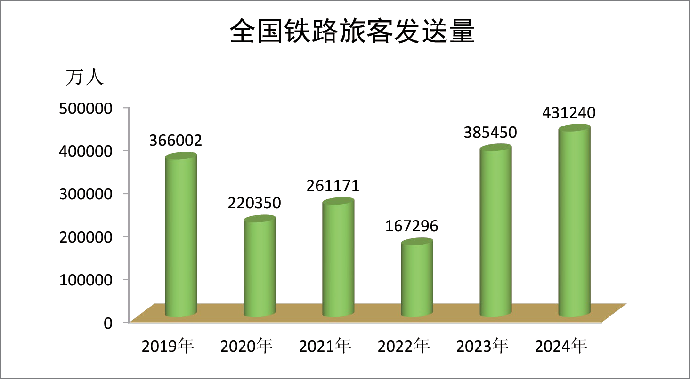
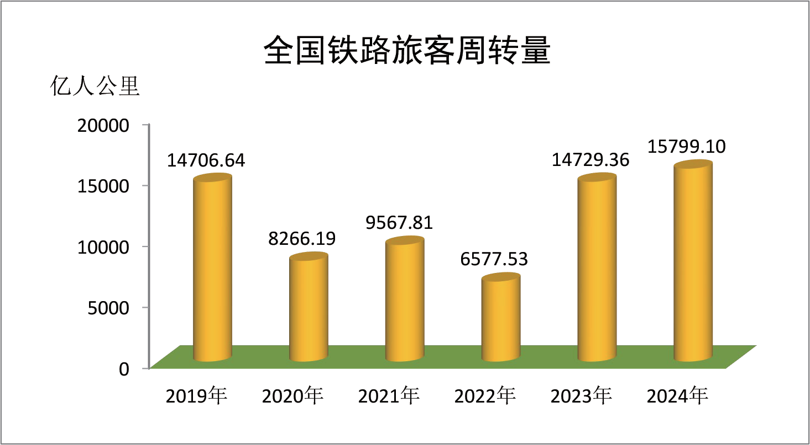
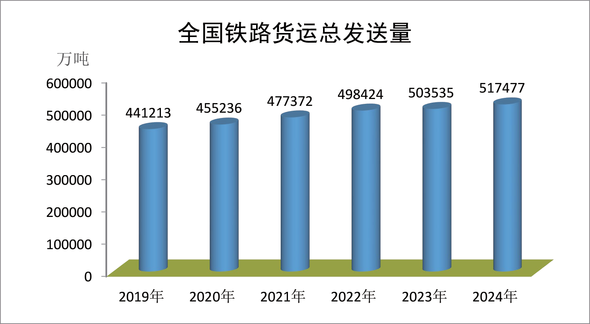
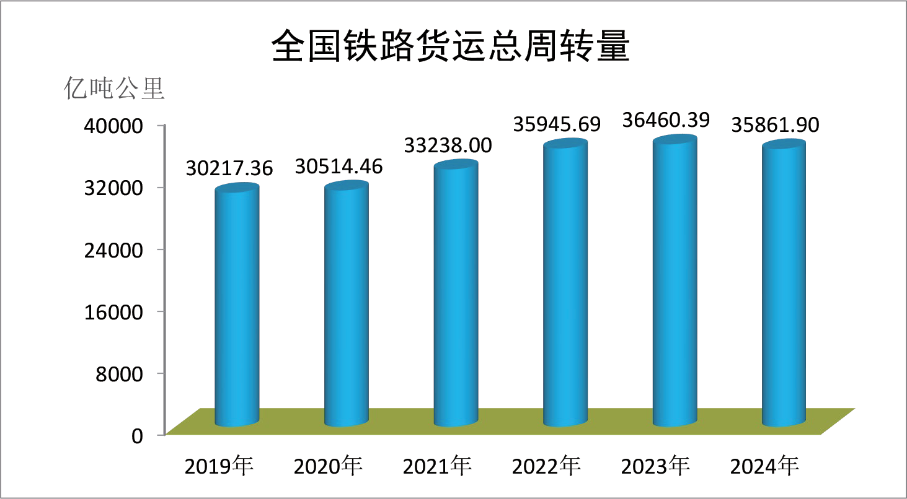
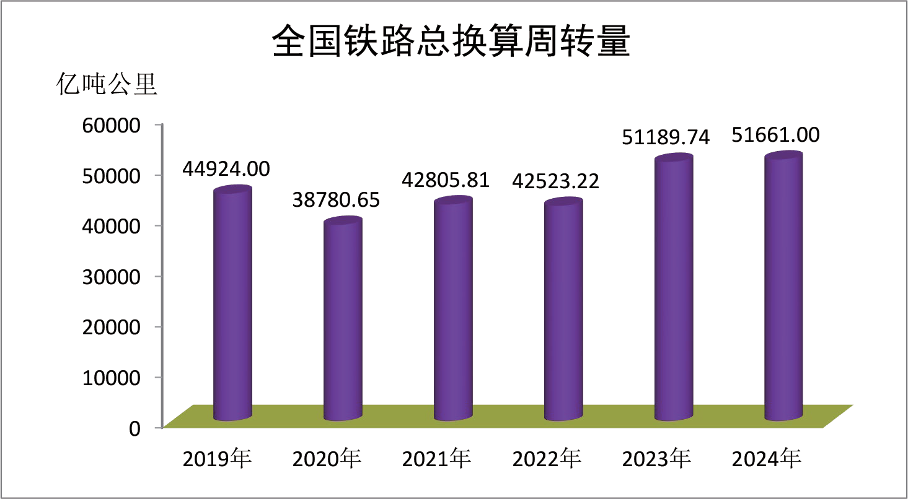
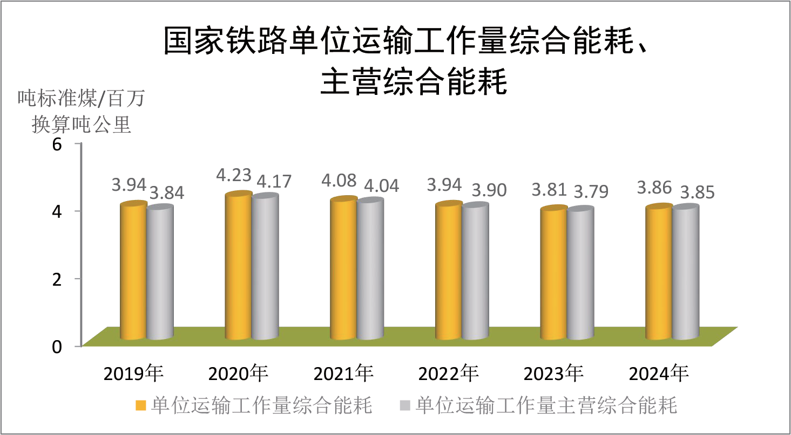
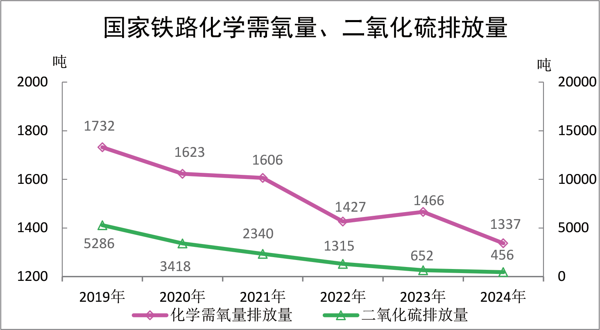

# railway_bulletin_2024

# 2024 年铁道统计公报

2024年，铁路行业坚持以习近平新时代中国特色社会主义思想为指导，全面贯彻党的二十大和二十届二中、三中全会精神，按照党中央、国务院决策部署，坚持稳中求进工作总基调，完整、准确、全面贯彻新发展理念，服务加快构建新发展格局，推动铁路高质量发展取得新成效，有力支撑了我国经济持续回升向好。

一、运输生产旅客运输。全国铁路旅客发送量完成43.12 亿人，比上年增加4.58 亿人，增长11.9%。其中，国家铁路40.85 亿人，比上年增长10.9%；其他铁路2.27 亿人，比上年增长34.0%。全国铁路旅客周转量完成15799.10 亿人公里，比上年增加1069.74 亿人公里，增长7.3%。其中，国家铁路15776.35 亿人公里，比上年增长7.2%；其他铁路22.74 亿人公里，比上年增长85.9%。

- 1 —

<!-- Page 2 -->

全国铁路旅客运输量

|单 位|2024 年|
|---|---|
|万人|431240|
|万人|408516|
|万人|22724|
|亿人公里|15799.10|
|亿人公里|15776.35|
|亿人公里|22.74|
指标单位 2024 年比上年±% 431240 11.9 旅客发送量万人 408516 10.9 国家铁路万人 22724 34.0 其他铁路万人 15799.10 7.3 旅客周转量亿人公里 15776.35 7.2 国家铁路亿人公里 22.74 85.9 其他铁路亿人公里

- 2 —

<!-- Page 3 -->

货物运输。全国铁路货运总发送量完成51.75 亿吨，比上年增加1.39 亿吨，增长2.8%。其中，国家铁路39.85 亿吨，比上年增长1.9%；其他铁路11.89 亿吨，比上年增长5.8%。全国铁路货运总周转量完成35861.90 亿吨公里，比上年减少598.49 亿吨公里，下降1.6%。其中，国家铁路32580.63 亿吨公里，比上年下降0.2%；其他铁路3281.26 亿吨公里，比上年下降14.1%。

全国铁路货物运输量

|指 标|单 位|2024 年|比上年±%|
|---|---|---|---|
|货运总发送量|万吨|517477|2.8|
|国家铁路|万吨|398531|1.9|
|其他铁路|万吨|118946|5.8|
|货运总周转量|亿吨公里|35861.90|-1.6|
|国家铁路|亿吨公里|32580.63|-0.2|
|其他铁路|亿吨公里|3281.26|-14.1|

- 3 —

<!-- Page 4 -->

重点运输。全国铁路煤炭运量完成28.24 亿吨，比上年增长 1.5%；冶炼物资运量完成8.77 亿吨，比上年下降3.6%；石油运量完成1.33 亿吨，比上年增长2.1%；粮食运量完成0.56 亿吨，比上年下降17.6%；化肥及农药运量完成0.48 亿吨，比上年下降 5.2%；集装箱运量完成9.14 亿吨，比上年增长15.5%。

全国铁路主要品类运量

|指 标|单 位|2024 年|比上年±%|
|---|---|---|---|
|煤|万吨|282365|1.5|
|冶炼物资|万吨|87726|-3.6|
|石油|万吨|13322|2.1|
|粮食|万吨|5640|-17.6|
|化肥及农药|万吨|4765|-5.2|
|集装箱|万吨|91371|15.5|
中欧班列开行1.9 万列，发送货物207 万标箱，比上年分别增长10%、9%。西部陆海新通道班列发送货物96 万标箱，比上年增长11%。

- 4 —

<!-- Page 5 -->

换算周转量。全国铁路总换算周转量完成51661.00 亿吨公里，比上年增加471.25 亿吨公里，增长0.9%。其中，国家铁路 48356.99 亿吨公里，比上年增长2.1%；其他铁路3304.01 亿吨公里，比上年下降13.8%。

运输安全。全年全国铁路未发生铁路交通特别重大、重大事故；发生较大事故2 件，与上年持平。铁路交通事故死亡人数比上年下降18.0%。

二、铁路建设全国铁路固定资产投资完成8506 亿元，投产新线3113 公里，其中高速铁路2457 公里。

全国铁路营业里程达到16.2 万公里，其中，高速铁路营业里程达到4.8 万公里；复线率60.8%；电化率76.2%；西部地区铁路营业里程6.6 万公里。全国铁路路网密度168.5 公里/万平方公里。

三、运输装备全国铁路机车拥有量为2.25万台，其中，内燃机车0.78万台，

- 5 —

<!-- Page 6 -->

电力机车1.47万台。全国铁路客车拥有量为8.1万辆，其中，动车组 4806标准组、38448辆。全国铁路货车拥有量为101.9万辆。

四、技术标准和科技创新重要技术标准制修订。

发布《轨道车重型轨道车》《铁路工程术语标准》等铁路国家标准20 项。发布《市域（郊）铁路动车组》《高速铁路工程动态验收技术规范》等铁路行业标准95 项。发布《液化气体铁路罐车容积检定规程》等铁路国家计量规程规范4 项，《铁路计量比对规范》等铁路行业计量规程规范4 项。发布由我国主持制定的《铁路应用制动系统通用要求》《高速铁路设计工程接口》等国际标准化组织（ISO）、国际铁路联盟（UIC）、电气与电子工程师协会（IEEE）国际铁路标准7 项。发布《铁道客车通用技术条件》（俄语译本）等铁路国家标准外文译本21 项，《高速铁路工程静态验收技术规范》等铁路行业标准英文译本5 项。

《市域（郊）铁路设计规范》等3 项标准获得中国工程建设标准化协会标准科技创新奖。我国2 名铁路专家获得国际标准化组织（ISO）“ISO 卓越贡献奖”。1 名专家获得国际电工委员会（IEC）“IEC 1906 奖”，这是我国第6 次获此奖项。

科技创新。

新研发BH10 冷藏车、FXD2BA 电力机车、FXD1BA 电力机车等3 个型号铁路装备。建立中国标准新能源机车平台。

铁路行业共有6 个项目获2023 年度国家科学技术奖，其中

- 6 —

<!-- Page 7 -->

“复兴号高速列车”项目获国家科学技术进步奖特等奖，“永磁电涡流阻尼减振缓冲耗能新技术研发与应用”项目获国家技术发明奖一等奖，“复杂运营条件下高速铁路轨道系统状态演化及科学维护技术”项目获国家科学技术进步奖二等奖，“350km/h 高速铁路道岔结构关键技术及应用”项目、“复杂应力环境下软弱土基坑工程安全控制绿色高效技术”项目获国家技术发明奖二等奖，“高速移动复杂场景信道特征及传输理论”项目获国家自然科学奖二等奖。铁路重大科技创新成果库2024 年度入库335 项，其中铁路科技项目50 项、铁路专利61 项、铁路技术标准24 项、铁路科技论文200 篇。

五、节能减排综合能耗。国家铁路能源消耗折算标准煤1801.2 万吨，比上年增加48.5 万吨，增长2.8%。单位运输工作量综合能耗3.86 吨标准煤/百万换算吨公里，比上年增加0.05 吨标准煤/百万换算吨公里，增长1.3%。单位运输工作量主营综合能耗3.85 吨标准煤/百万换算吨公里，比上年增加0.06 吨标准煤/百万换算吨公里，增长1.6%。

- 7 —

<!-- Page 8 -->

主要污染物排放量。国家铁路化学需氧量排放量1337 吨，比上年减少130 吨。二氧化硫排放量456 吨，比上年减少196 吨。

六、行业监管 1 部规章、7 件行政规范性文件完成制定、修订工作并予以公布。

铁路监管部门发布行政许可决定书622 件。经行政许可的铁路运输企业新增4 家，累计达到81 家；铁路运输基础设备生产企业新增2 家，累计达到116 家；铁路机车车辆设计制造维修进

- 8 —

<!-- Page 9 -->

口企业新增1 家，累计达到124 家；铁路无线电台站设置和频率使用企业新增80 家，累计达到336 家；铁路机车车辆驾驶人员新增10933 人，累计达到220308 人。

铁路监管部门实施行政处罚198 起，作出处罚决定383 个，实施预警262 次、通报333 次、约谈68 次、挂牌督办24 次。

注：1. 除注明外，国家铁路含国铁集团及其控股合资铁路。

2. 公报中部分数据因四舍五入的原因，存在总计与分项合计不等的情况。
3. 统计范围不含港澳台。
4. 除注明外，比上年为同口径。
- 9 —
