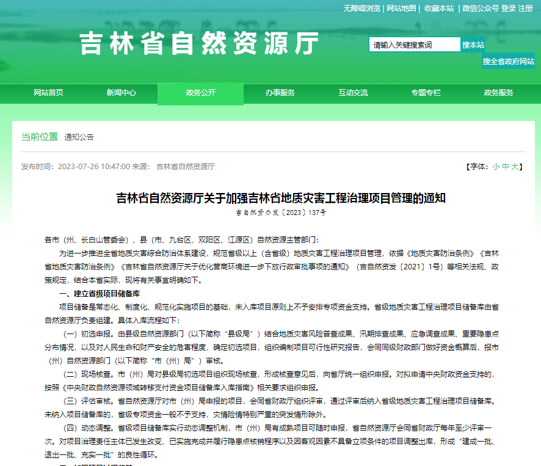
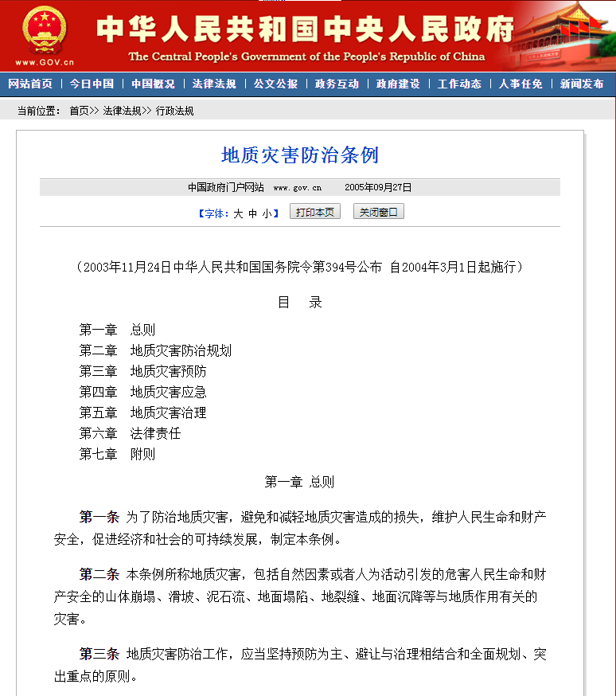
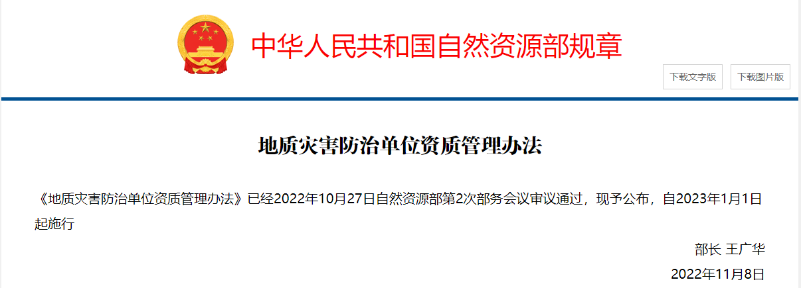

# jilin_geohazard_project_rules_policy

- Source: `jilin_geohazard_project_rules_policy.pptx`
- Total slides: 20

## Slide 1

吉林省自然资源厅

Department of Natural Resources of Jilin Province

- 吉林省地质灾害治理工程项目管理办法
- 政策解读

- 吉林省自然资源厅
- 2024年3月

## Slide 2

吉林省自然资源厅

Department of Natural Resources of Jilin Province

1

出台背景

2

- 目
- 录

政策依据

3

主体框架

4

规范内容

5

主要特点

## Slide 3

一、出台背景

- 为规范省级以上（含省级）地质灾害治理工程项目管理，2023年7月下旬，省厅印发了《吉林省自然资源厅关于加强吉林省地质灾害工程治理项目管理的通知》（吉自然资办发〔2023〕137号），该通知主要在地质灾害治理工程项目管理流程上提出了具体要求，进一步规范了全省地质灾害治理工程项目管理。
- 2023年9月以来，在已下发项目管理通知的基础上，我厅通过电话沟通、调研，并学习借鉴四川、云南、贵州、浙江、辽宁、甘肃等省外项目管理先进经验与做法的基础上，针对我省地质灾害治理工程项目管理中存在的突出问题和薄弱环节，对原项目管理通知进行了修改补充完善，形成了本《办法》。

背景介绍

## Slide 4

二、政策依据

- 1.《地质灾害防治条例》（国务院令第394号）
- 2.《政府投资条例》（国务院令第712号）
- 3.《国务院关于加强地质灾害防治工作的决定》（国发〔2011〕20号）
- 4.《国务院办公厅关于印发自然资源领域中央与地方财政事权和支出责任划分改革方案的通知》（国办发〔2020〕19号）
- 5.《吉林省人民政府办公厅关于印发吉林省自然资源领域财政事权和支出责任划分改革方案的通知》（吉政办发〔2020〕36号）
- 6.《地质灾害防治单位资质管理办法》（自然资源部令第8号）
- 7.《吉林省地质灾害防治条例》（2015年修正）
- 8.《中华人民共和国招标投标法》（2017年修正）
- 9.《必须招标的工程项目规定》（中华人民共和国国家发展和改革委员会令第16号）
- 10.《政府采购法》（2014年修正）
- 11.《吉林省矿产资源和生态修复治理专项资金管理办法》（吉财资环〔2020〕337号）

## Slide 5

三、主体框架

- 《办法》共七章28条，分别为总则、项目库建设、项目实施、项目验收、工程运行管护、监督检查和附则。
- 内容要点为：1.严格项目入库流程；2.明确各级任务职责；3.规范项目验收程序；4.细化工程运行管护；5.加强项目监督检查。

项目库建设项目入库流程

- 总则
- 总体要求

- 项目实施
- 勘查、设计、施工、监理单位职责

- 项目验收
- 明确项目验收分为自验、初步验收和竣工验收

工程运行管护后期管护责任与要求

- 监督检查
- 全过程监督管理

- 附则
- 其它说明

## Slide 6

四、规范内容

第三章 项目实施

第六条 省自然资源厅负责组织建立省级地质灾害治理工程项目库（以下简称项目库），除灾情险情特别严重的突发情形外，未入库项目不予立项。具体入库流程如下：

初选申报：由市、县级自然资源主管部门主要根据本级地质灾害防治规划及突发灾情险情，在重点区域内确定初选项目，组织编制项目可行性研究报告，会同同级财政部门制定资金筹措方案经同级人民政府批准后，填报项目绩效目标表，报上一级自然资源主管部门核查。 ※对于跨行政区的地质灾害治理工程项目，由共同的上一级自然资源主管部门，明确其中一个市、县级自然资源主管部门组织申报。

01

现场核查。对市、县级自然资源主管部门确定的初选项目，上一级自然资源主管部门要组织专家现场核查，形成核查意见后，由市（州）级自然资源主管部门向省自然资源厅和省财政厅统一申报。对拟申请中央财政资金支持的，按照《中央财政自然资源领域转移支付资金项目储备库入库指南》相关要求申报。

02

评估审核。市（州）级自然资源主管部门申报的治理工程项目，省自然资源厅会同省财政厅每年至少组织专家评审一次，通过评审，具备入库条件的，经排序入项目库。

03

动态调整。项目库实行动态调整机制，对已纳入项目库的项目，根据年度资金预算情况择优安排。因治理责任主体发生改变、属地政府已利用自筹资金治理完成以及其他原因不能立项的，市（州）级自然资源主管部门应将调整理由以正式文件报省自然资源厅和省财政厅备案，项目调整出库。

04

## Slide 7

四、规范内容

第三章 项目实施

各级自然资源主管部门主要职责

第七条 各级自然资源主管部门应在当地政府的领导下，切实加强本行政区域内项目的组织、协调、指导和监督工作，组织开展项目勘查、设计的评审和工程验收，监督后期管护工作。

项目管理原则

第八条 原则上市、县级自然资源主管部门应为项目建设单位，项目涉及的勘查、设计、施工、监理等单位，应依法依规通过政府采购方式确定并签订相应合同。由市级自然资源主管部门作为建设单位的项目，参照中央财政出资的项目进行管理。

## Slide 8

四、规范内容

第三章 项目实施

第九条：勘查单位在项目实施过程中职责

1

针对地质环境条件、致灾地质体特征和危害程度，制定相应的工程勘查设计书或者勘查方案。

勘查工作应当满足国家规定的规范规程、委托书、勘查合同以及相应勘查阶段要求，工作成果应当进行野外验收。

2

3

参加设计交底、现场验槽、设计变更、单元工程阶段性验收、质量事故分析以及工程初步验收与竣工验收等工作。

4

施工期间发现实际与勘查成果出入较大时，应进行补充勘查。

## Slide 9

四、规范内容

第三章 项目实施

第十条：设计单位在项目实施过程中职责

03

01

施工期间进行设计变更时，按有关要求编制设计变更报告

按照勘查成果和有关规范规程开展设计工作，明确工程的设计使用年限。建设单位对建设工程的设计使用年限有特殊要求的，须由建设单位与设计单位签订合同时予以明确，并由设计单位在设计文件中注明。

04

负责项目实施期间设计服务，参加技术交底、现场验槽、单元工程阶段性验收，质量事故分析以及工程初步验收与竣工验收等工作

05

02

在设计中采用新技术、新工艺、新材料、新设备的，应当说明其技术性能和使用注意事项，并提出质量保障措施。

对工程施工可能存在的安全风险进行分析，并提出相应风险防控措施。

## Slide 10

四、规范内容

第三章 项目实施

第11-13条 对项目设计的其它要求

- 第十一条 由市、县级自然资源主管部门负责提交项目设计方案。
- ☆ 中央财政出资的项目设计，由省自然资源厅审核；
- ☆ 省级财政出资的项目设计，由市（州）级自然资源主管部门审核。
- ☆ 审核部门应组织专家到项目现场进行实地核查，由专家组出具书面审核意见并对审核结果负责。

- 第十二条 市、县级自然资源主管部门应监管施工单位严格按审定的设计方案施工，因客观原因需变更设计方案，由原设计单位编制设计变更方案，报经原审批单位组织评审并经批准后实施；
- 重大设计变更方案需经市（州）级自然资源主管部门审核后，报省自然资源厅和省财政厅审批。

第十三条 施工中发现地质环境等客观条件变化或实际与勘查成果出入较大，原设计的地质灾害治理主体工程类型、结构、数量以及位置和范围需要调整，对工程的安全性需要重新进行复核论证的，属于重大设计变更。

## Slide 11

四、规范内容

第三章 项目实施

第十四条：施工单位在项目实施过程中职责

01

配备项目负责人和相关专业技术人员，调整主要管理人员时，应书面征得建设单位同意。

编制施工组织方案，明确安全生产的具体措施，保障工程施工安全生产条件。

02

质量和安全生产隐患排查治理、风险管控、质量检验制度，及时处置工程质量问题和安全生产隐患，负责对存在质量问题的工程进行整改维护。

03

04

施工中发现实际与勘查成果出入较大时，应及时通知建设单位和监理单位。

开展施工安全专项风险评估，对危险性较大的土方开挖、模板及支撑体系、人工挖孔桩等分部分项工程，应当编制安全专项施工方案。

05

采取必要的安全措施防范安全生产事故，施工现场的办公、生活区不得设置在地质灾害危险区内。

06

## Slide 12

四、规范内容

第三章 项目实施

对项目施工单位的其它要求

- 第十五条 地质灾害治理工程实行施工总承包制，施工单位不得将其承接的工程进行转包或者违法分包。
- 第十六条 施工单位应当根据设计要求，做好地质灾害治理工程监测工作并形成监测记录，监测周期包含施工期间以及竣工验收后不少于一个水文年。
- 设计文件要求委托第三方进行监测的，由建设单位另行委托。

## Slide 13

四、规范内容

第三章 项目实施

第十七条：监理单位在项目实施过程中职责

全过程监理

检查施工单位的质量和安全生产制度及措施落实情况；核查主要管理人员和关键设备到位情况、相关从业人员依法应当取得的执业资格证书或者考核合格证书情况、设备合格证书和施工技术档案情况；督促施工单位及时整改工程质量问题，消除安全生产隐患。

监理工程师应当按照工程监理规范的要求，采取旁站、巡视和平行检验等形式对工程实施监理，并及时、真实、完整地做好监理记录。

按建设单位要求，组织或参加设计交底、施工组织方案审查、开工报告审查、存在较大危险性隐患的分部分项工程专项施工方案审查、现场验槽、单元工程阶段性验收、质量事故分析以及工程初步验收与竣工验收等工作。

编制监理规划和监理实施细则，建立与项目规模、专业相适应的监理机构，确定总监理工程师和监理人员。监理工程师不得擅自调整，确需调整的应符合监理合同约定要求并征得建设单位同意。

## Slide 14

四、规范内容

第三章 项目实施

第十八条

第二十条

第十九条

- 项目实施期限原则上应自预算下达之日起2年内完成竣工验收及财务决算；
- 因施工条件等不可抗力客观因素确需延期的，市、县级自然资源主管部门须向省自然资源厅和省财政厅书面说明情况，经同意后可延期1年。

- 项目的勘查、设计成果以及施工组织方案、监理规划等技术文件，应当符合相关法律、法规、规章规定，工程建设强制性标准、规范规程以及合同约定。
- 任何单位和个人不得擅自压缩工程勘查、设计周期和施工工期；不得提供虚假的工程资料；不得代签有关工程资料。

项目相关单位应当按照档案管理有关法律、法规、规章规定，及时、真实、完整记录工程建设过程中的信息资料，建立工程项目档案，并及时向建设单位移交。

## Slide 15

四、规范内容

第四章 项目验收（第二十一条）

项目完工之日起1个月内

自行检验

01

工程竣工后，市、县级自然资源主管部门应组织勘查、设计、施工、监理等参建单位自验，主要核对施工设计和合同约定的各项工程内容是否已完成、监理单位对工程质量的评定是否合格、施工及监理单位工作总结等竣工资料准备是否齐全等，为初步验收做好准备。

项目完工之日起3个月内

初步验收

02

中央财政出资的项目，由市（州）级自然资源主管部门会同同级财政部门组织专家进行审查验收；省级财政出资的项目，由县级自然资源主管部门会同同级财政部门组织专家进行审查验收，专家组（不少于5人，含1名财审专家）提出初步验收结论。对于质量评定为不合格的，经整改后，重新组织初验。

初步验收通过后3个月内

竣工验收

03

项目通过初步验收后，中央财政出资的项目，市（州）级自然资源主管部门应向省自然资源厅提出申请，由省自然资源厅会同省财政厅组织专家进行验收。省级财政出资的项目，县级自然资源主管部门应向市（州）级自然资源主管部门提出申请，由市（州）级自然资源主管部门会同同级财政部门组织专家进行验收。专家组（不少于5人，含1名财审专家）对项目工程质量、建设情况及预算执行情况进行全面检查，对项目工程质量进行综合评分、评定等级，形成验收意见，并提出该处地质灾害隐患点的核销或降级意见。验收结果为不合格的，经整改后重新组织竣工验收。

资料归档

04

市、县级自然资源主管部门应做好项目全周期资料的整理归档工作，备查备检；项目完成财务结算后，将项目全过程资料按要求报送省自然资源厅。

## Slide 16

四、规范内容

第四章 项目验收（第二十一条）

项目验收参建单位提交资料清单

            - 1.项目立项批准文件及任务书；
            - 2.经审查批准的项目设计书；
            - 3.确定项目参建单位的文件、中标通知书及合同；
            - 4.参建单位相应资质复印件；
            - 5.开工报告、施工日志、监理日志、实验检测报告、关键工序检查记录、
            - 重点工程的原始施工记录、工程竣工图；
            - 6.工程施工质量评定报告及验收评定表；
            - 7.重点质量事故处理资料；
            - 8.工程进度款支付和费用调整依据，工程结算总结材料；
            - 9.竣工报告、施工总结报告、监理总结报告、第三方工程复核报告；
            - 10.与工程有关的影像、图片等多媒体资料；
            - 11.其他必要的有关材料。

## Slide 17

四、规范内容

第五章 工程运行管护（第二十二条）

施工单位在向建设单位提交工程竣工验收报告时，应当出具工程质量保修书。质量保修书中应当明确地质灾害治理工程的保修范围、保修期限和保修责任等，保修期限以施工合同约定为准，自竣工验收通过之日起计算。国家对保修期限有明确规定的，施工合同约定的保修期限不得低于国家规定。

明确管护责任

市、县级自然资源主管部门应在项目竣工验收合格并投入运行的15个工作日内，与指定的管护单位进行交接，签订《工程移交接管协议书》，明确管护单位管理维护制度，做好项目后续管理和维护。

加强后续管护

市、县级自然资源主管部门应在项目治理区内设置标牌，载明项目勘查、设计、施工、监理、管护等单位相关信息，加强项目运行管护监督，督促管护单位履行好工程运行管护责任。在保修期限内发生质量问题的项目，由项目施工单位进行维修，所需维修费用由相关责任方按照国家和省有关规定承担；超出保修期限后，项目管护费用由管护单位承担。

履行认定核销程序

经工程治理后的隐患点，由市、县级自然资源主管部门根据专家组竣工验收意见，向省自然资源厅申请地质灾害隐患点核销或降级。

## Slide 18

四、规范内容

第七章 附则

第二十七条

本办法由省自然资源厅负责解释。市、县级自然资源主管部门可以参照本办法，结合当地实际，制定本地区地质灾害防治项目管理制度，报上一级自然资源主管部门备案。

第二十八条

本办法自印发之日起施行,有效期5年。

## Slide 19

五、主要特点

项目选择精准化

监督检查常态化

项目运行规范化

《办法》明确了项目支持的范围、入库流程、专家评审论证和动态调整等内容。将有利于夯实项目实施基础，加快资金分配，避免“资金等项目”的情况，提升资金使用效益。

建立完善了项目入库流程、项目实施单位职责、项目验收阶段划分、工程后期运维管护和全过程监督检查的整套运行规程。规范化的运行有助于各级主管部门和参建单位明确项目步骤、自身职责、时间期限和质量标准，有效提高工作效率和项目质量。

按照“双随机、一公开”规定了监督检查要求，建立了报告、通报、激励、惩戒、责任追究等制度，加强了项目事前、事中、事后全过程监督管理，有利于及时发现项目问题，及时整改，确保项目顺利完成。

## Slide 20

吉林省自然资源厅

Department of Natural Resources of Jilin Province

地址：吉林省长春市长春大街518号
